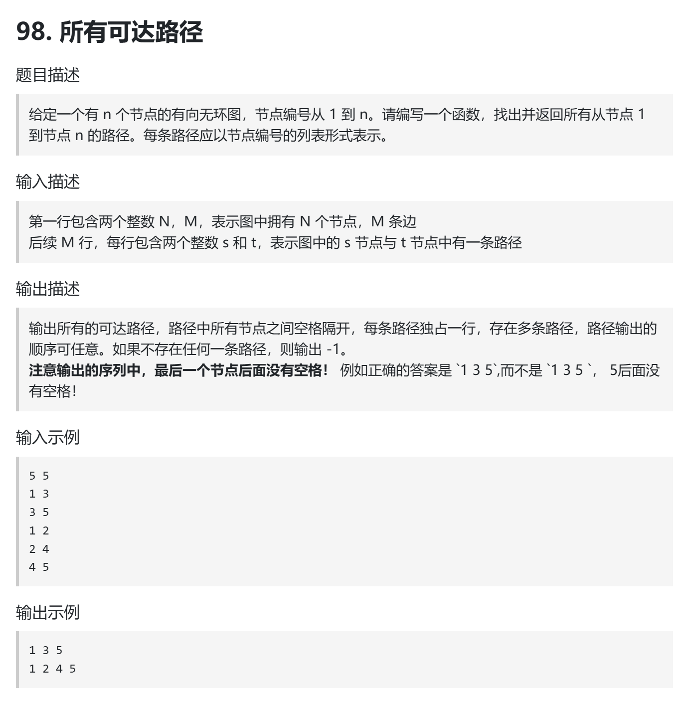
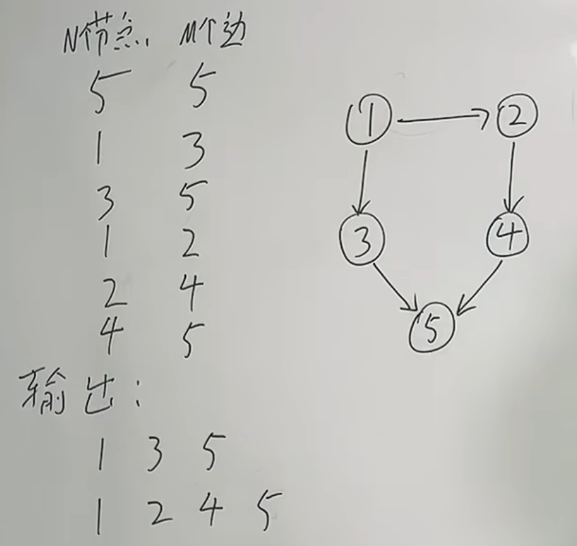
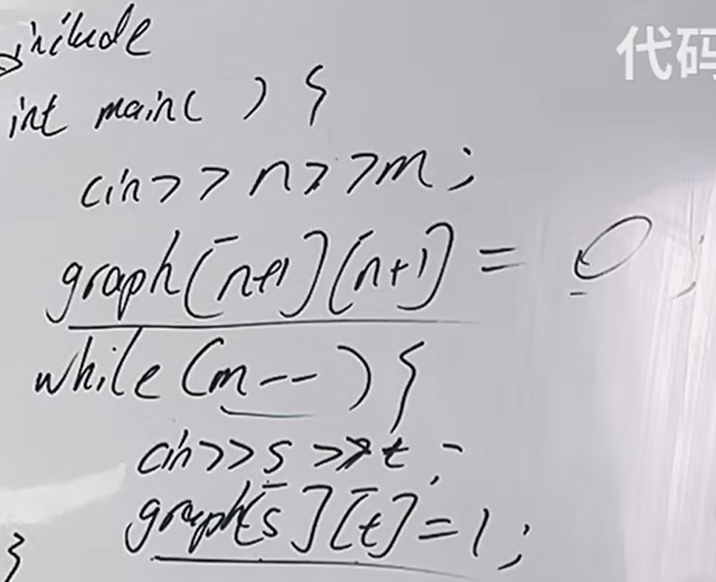
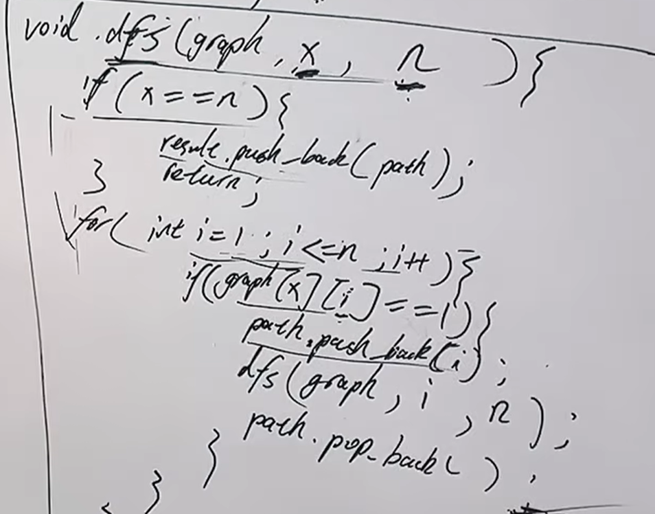

卡码：https://kamacoder.com/problempage.php?pid=1170  
代码随想录：https://www.programmercarl.com/kamacoder/0098.%E6%89%80%E6%9C%89%E5%8F%AF%E8%BE%BE%E8%B7%AF%E5%BE%84.html  

  

## 思路

### 1.图的存储

### 2.深搜三部曲


## 题解
1.邻接矩阵写法
```python
def dfs(graph, x, n, path, result):
    if x == n:
        result.append(path.copy())
        return
    for i in range(1, n + 1):
        if graph[x][i] == 1:
            path.append(i)
            dfs(graph, i, n, path, result)
            path.pop()

def main():
    n, m = map(int, input().split())
    graph = [[0] * (n + 1) for _ in range(n + 1)]

    for _ in range(m):
        s, t = map(int, input().split())
        graph[s][t] = 1

    result = []
    dfs(graph, 1, n, [1], result)

    if not result:
        print(-1)
    else:
        for path in result:
            print(' '.join(map(str, path)))

if __name__ == "__main__":
    main()
```
