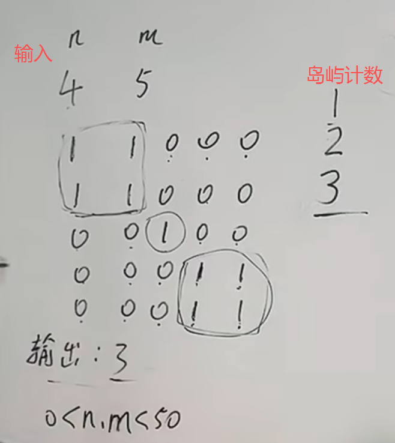

注意深搜的两种写法，熟练掌握这两种写法 以及 知道区别在哪里，才算掌握的深搜。
https://www.programmercarl.com/kamacoder/0099.%E5%B2%9B%E5%B1%BF%E7%9A%84%E6%95%B0%E9%87%8F%E6%B7%B1%E6%90%9C.html  

## 解题思路

## main函数
存图（并不是邻接矩阵）：

## dfs函数
### 写法一：
 
### 写法二：

