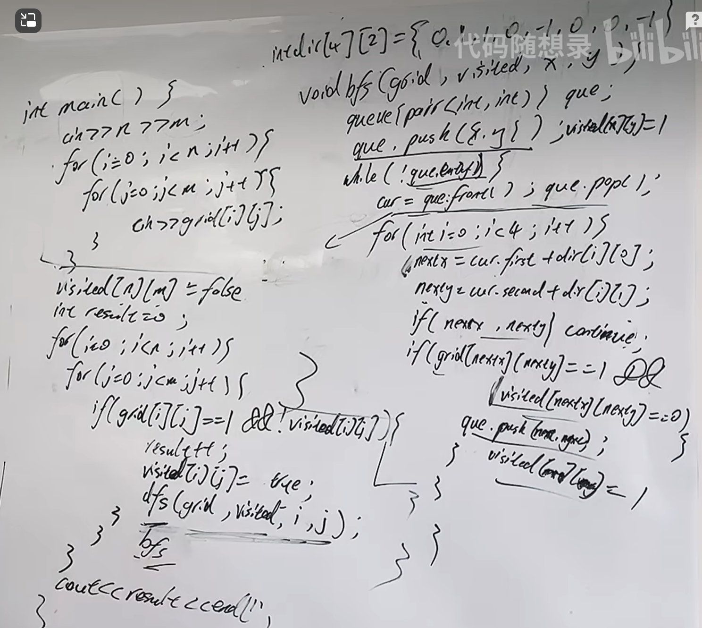
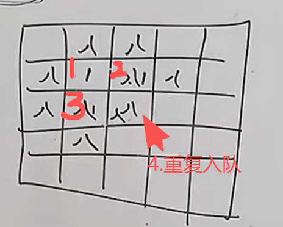
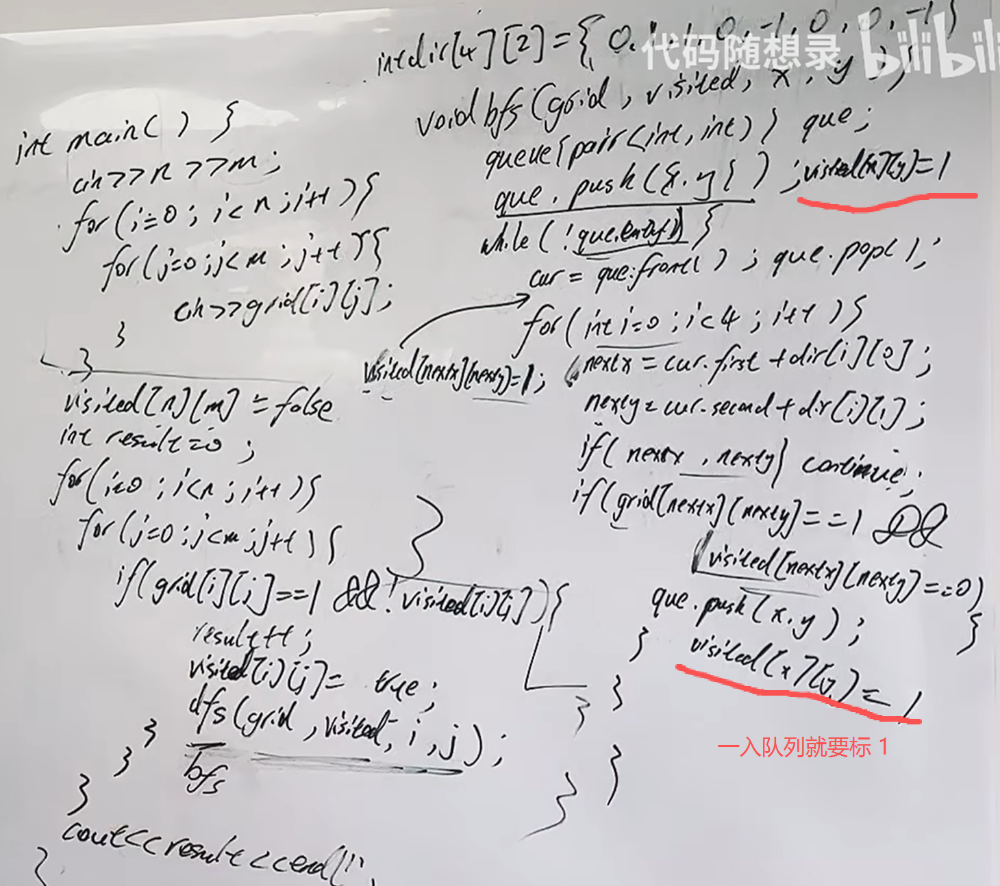

注意广搜的两种写法，第一种写法为什么会超时， 如果自己做的录友，题目通过了，也要仔细看第一种写法的超时版本，弄清楚为什么会超时，因为你第一次 幸运 没那么想，第二次可就不一定了。
https://www.programmercarl.com/kamacoder/0099.%E5%B2%9B%E5%B1%BF%E7%9A%84%E6%95%B0%E9%87%8F%E5%B9%BF%E6%90%9C.html

## 解题思路

## 广搜陷阱
（全是陆地）

解决：
