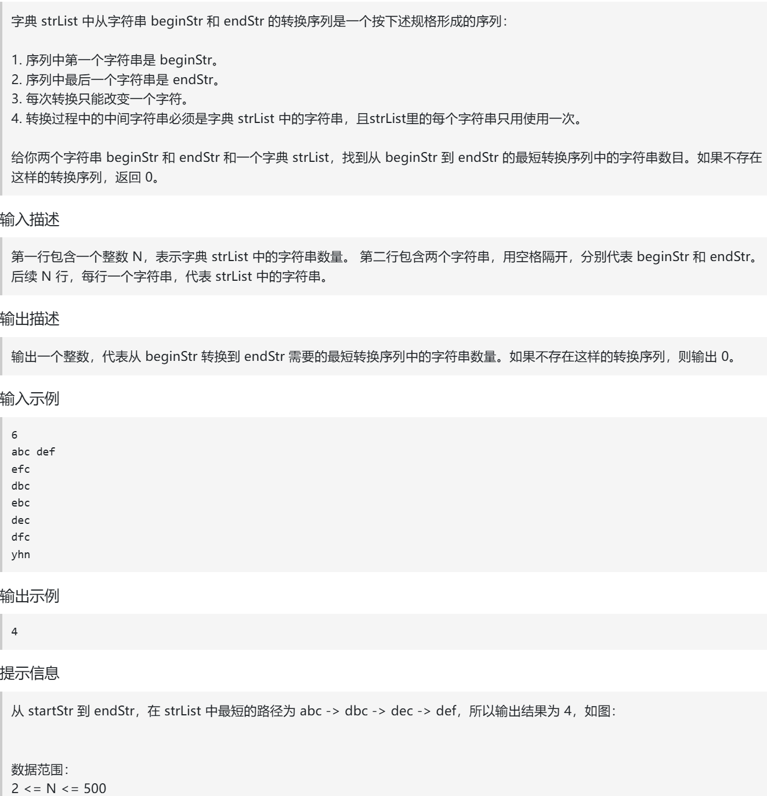
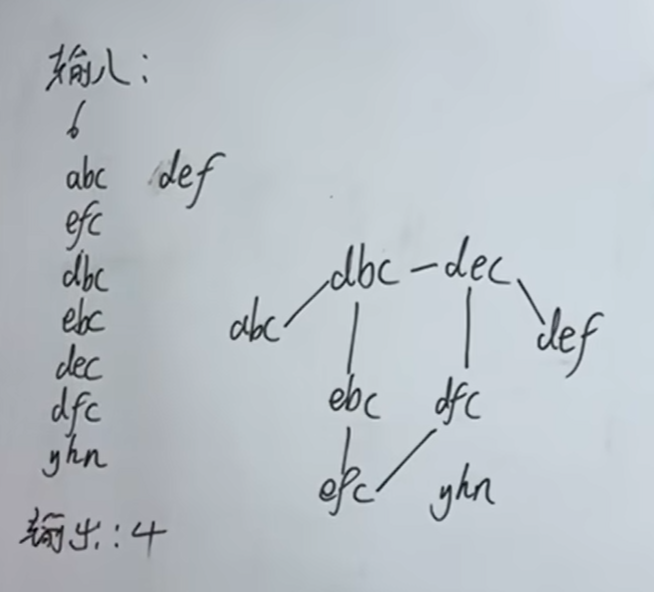

经过上面的练习，大家可能会感觉 广搜不过如此，都刷出自信了，本题让大家初步感受一下，广搜难不在广搜本身，而是如何应用广搜。
https://www.programmercarl.com/kamacoder/0110.%E5%AD%97%E7%AC%A6%E4%B8%B2%E6%8E%A5%E9%BE%99.html

卡码：https://kamacoder.com/problempage.php?pid=1183

视频：https://www.bilibili.com/video/BV1QEEizDEC4?vd_source=75999e486c99100a44781daea5d0beae&spm_id_from=333.788.player.switch

## 特点
- 无权图，不需要用Dijkstra算法，用深搜或者广搜就可以了
- 用广搜最合适，比较容易实现

