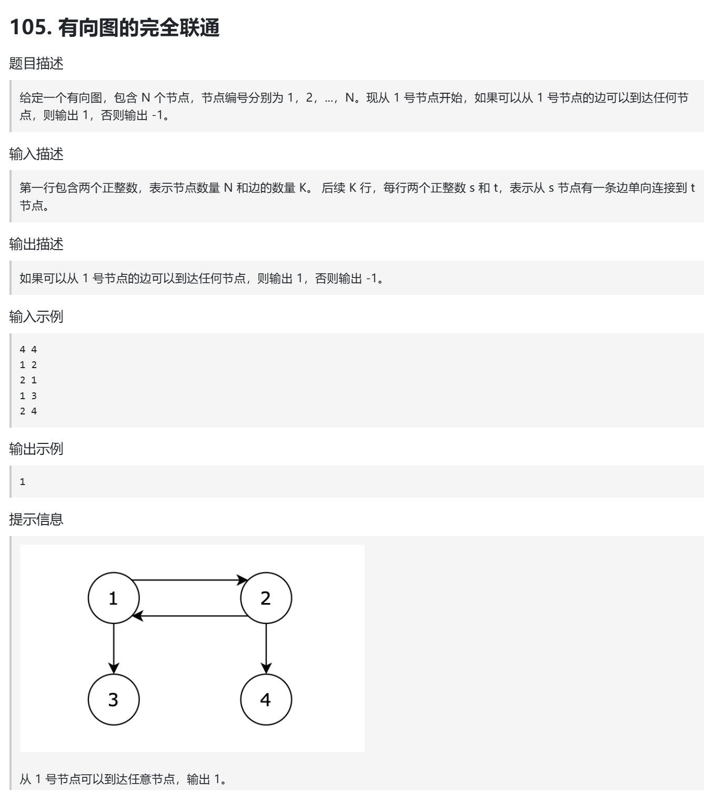
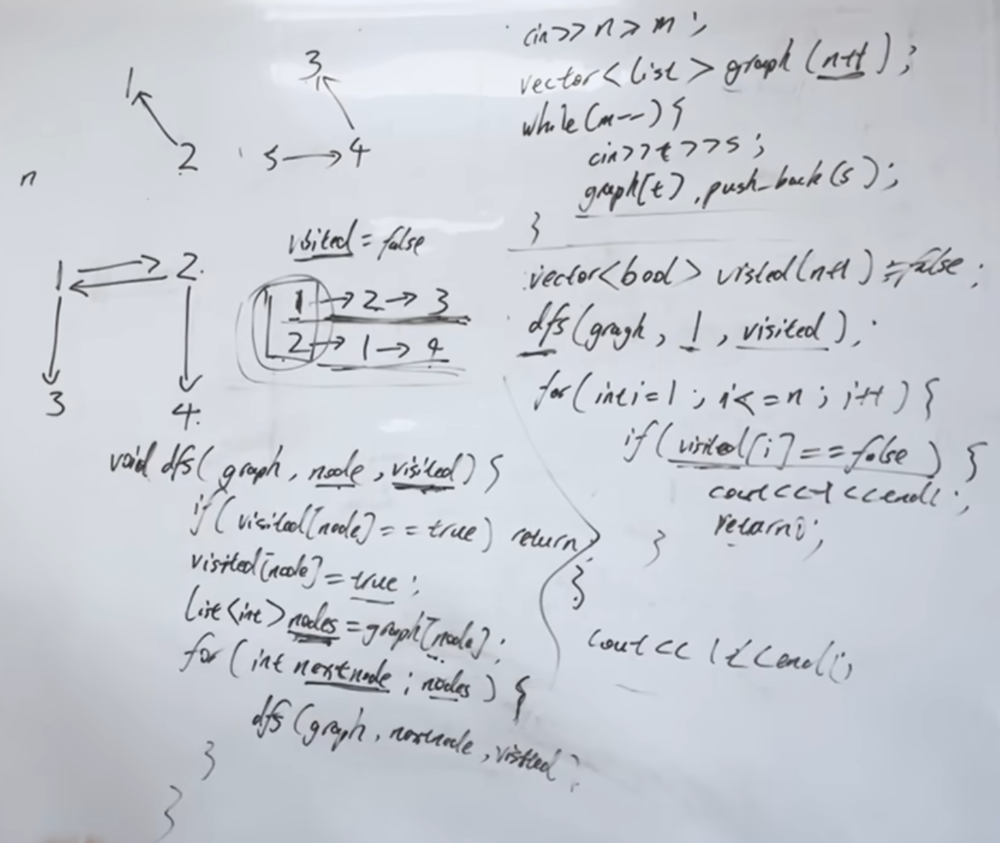

深搜有细节，同样是深搜两种写法的区别，以及什么时候需要回溯操作呢？
https://www.programmercarl.com/kamacoder/0105.%E6%9C%89%E5%90%91%E5%9B%BE%E7%9A%84%E5%AE%8C%E5%85%A8%E5%8F%AF%E8%BE%BE%E6%80%A7.html

## 特点
有向图
### 解题方法
dfs（或bfs） + 邻接表（也可以使用邻接矩阵）

