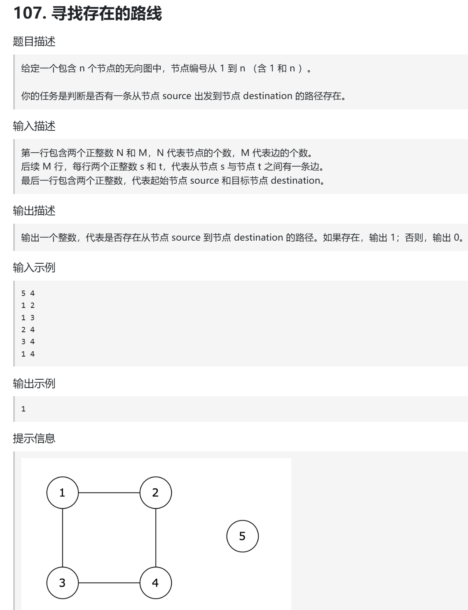
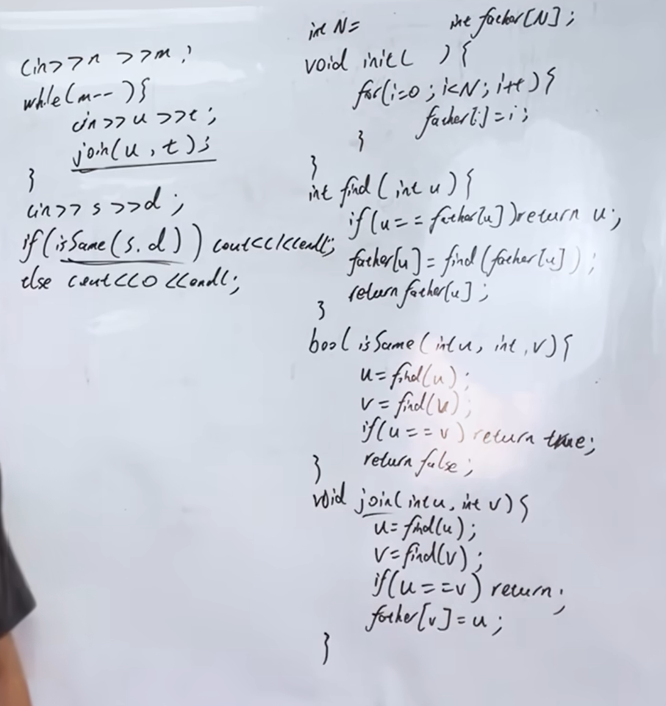

并查集裸题，学会理论基础后，本题直接可以直接刷过
https://www.programmercarl.com/kamacoder/0107.%E5%AF%BB%E6%89%BE%E5%AD%98%E5%9C%A8%E7%9A%84%E8%B7%AF%E5%BE%84.html

视频：https://www.bilibili.com/video/BV1k3T7zWEVj?vd_source=75999e486c99100a44781daea5d0beae&spm_id_from=333.788.player.switch

卡码网：https://kamacoder.com/problempage.php?pid=1179

## 思路
- 可以用深搜或广搜
- 也可以使用并查集
> 必须是无向图才能用并查集，有向图不能用并查集

 

