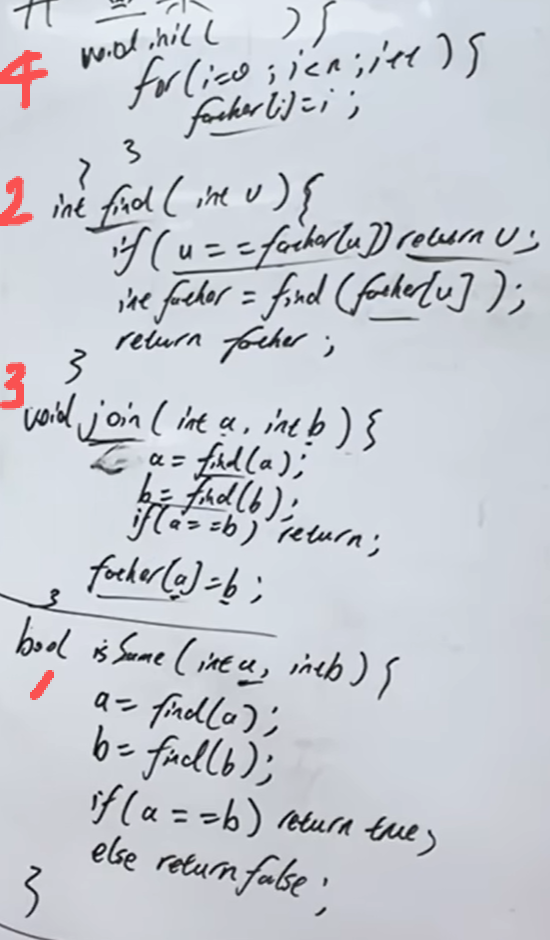

https://programmercarl.com/kamacoder/%E5%9B%BE%E8%AE%BA%E7%90%86%E8%AE%BA%E5%9F%BA%E7%A1%80.html#%E5%9B%BE%E7%9A%84%E5%9F%BA%E6%9C%AC%E6%A6%82%E5%BF%B5  

## 深搜三部曲


## 广度优先搜索 代码实现
```python
#grid[][]:邻接矩阵
#visided[][]：访问过哪些节点
#x,y:当前处理的结点下标
#dir[][]:遍历的四个方向
```