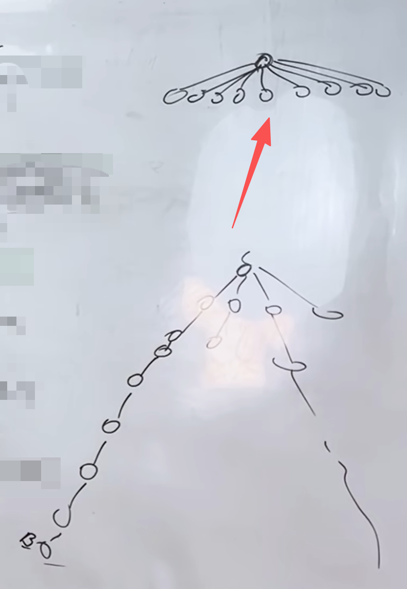
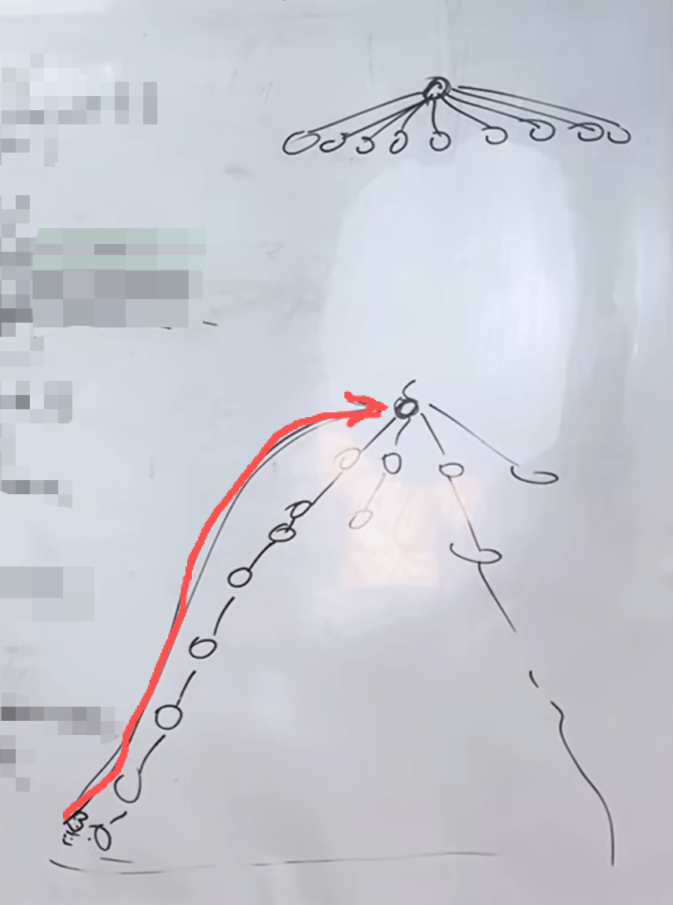

## 用并查集的场景
- 将两个元素添加同一集合
- 判断两个元素是否在同一集合

## 代码实现

```python
father = []

def init(n):
    global father
    father = [0] * n
    for i in range(n):
        father[i] = i

def find(u):
    global father
    if u == father[u]:
        return u
    else:
        root = find(father[u])
        return root

def join(a, b):
    global father
    root_a = find(a)
    root_b = find(b)
    
    if root_a == root_b:
        return
    
    father[root_a] = root_b

def isSame(a, b):
    root_a = find(a)
    root_b = find(b)
    
    if root_a == root_b:
        return True
    else:
        return False

```

## 路径压缩
- 将层数改成两层 


```python
def find(u):
    global father
    if u == father[u]:
        return u
    else:
        root = find(father[u])
        #路径压缩
        father[u] = root
        return root
```

