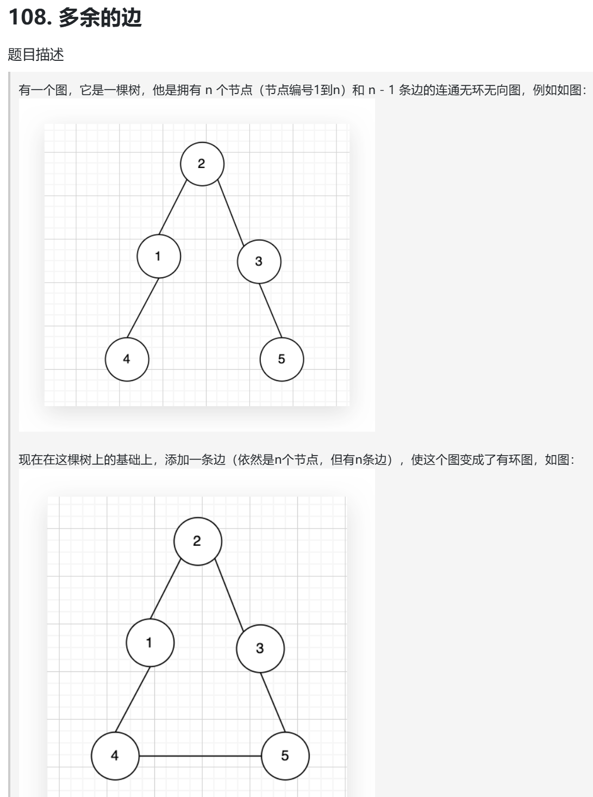
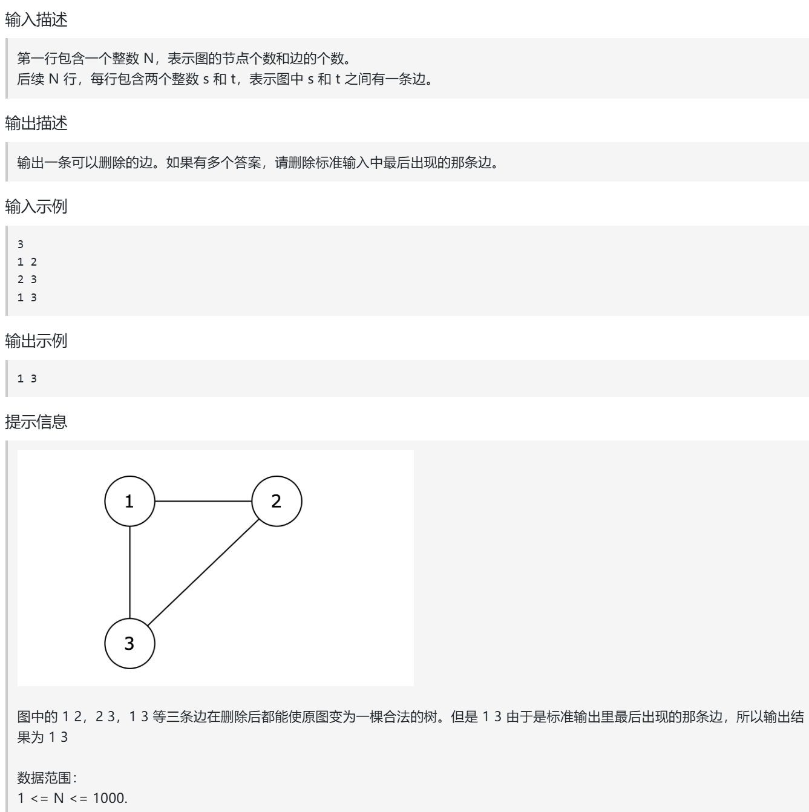

并查集应用类题目，关键是如何把题意转化成并查集问题  
卡码：https://kamacoder.com/problempage.php?pid=1181  

https://www.programmercarl.com/kamacoder/0108.%E5%86%97%E4%BD%99%E8%BF%9E%E6%8E%A5.html 

## 特点
有向图

## 思路
### 并查集的方法
不在一个并查集就链接，在一个并查集就输出
### DFS/BFS的方法
- 不在一个图里，没有链接，就链接起来
- 在一个图里，有链接，就输出