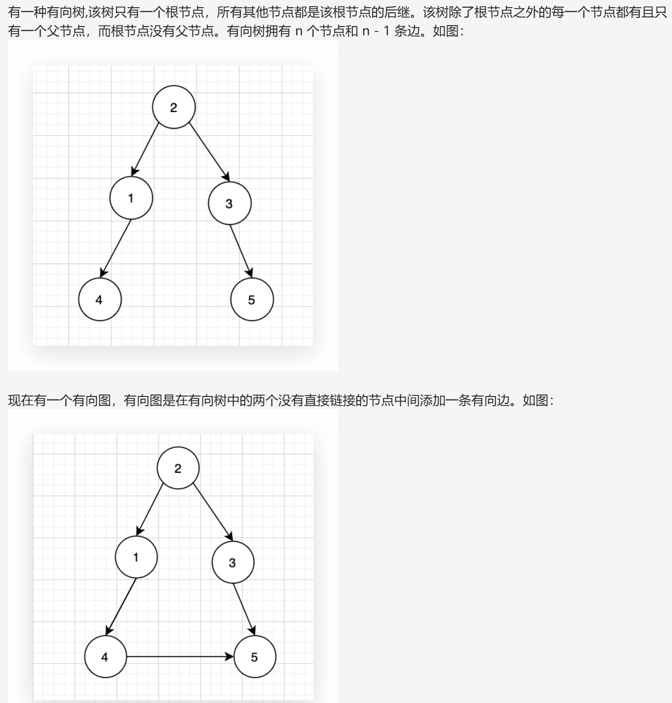
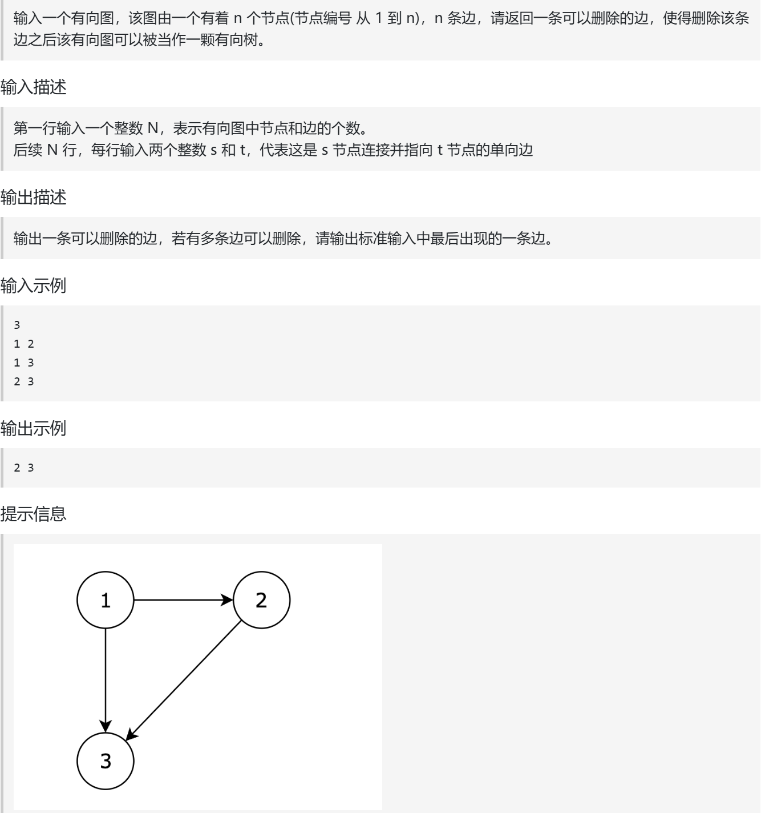
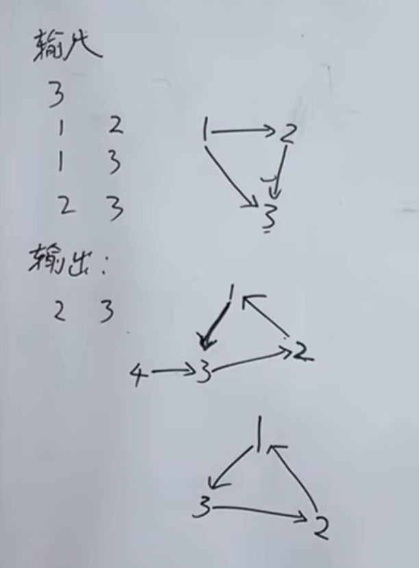

上面两道题目是不是感觉做出自信了，感觉并查集不过如此？ 
来这道题目 给大家适当一些打击， 难度上来了。  
视频：https://www.bilibili.com/video/BV1t2NEzaEMR?vd_source=75999e486c99100a44781daea5d0beae&spm_id_from=333.788.player.switch  

代码随想录：https://www.programmercarl.com/kamacoder/0109.%E5%86%97%E4%BD%99%E8%BF%9E%E6%8E%A5II.html

卡码：https://kamacoder.com/problempage.php?pid=1182

## 思路
有三种情况

