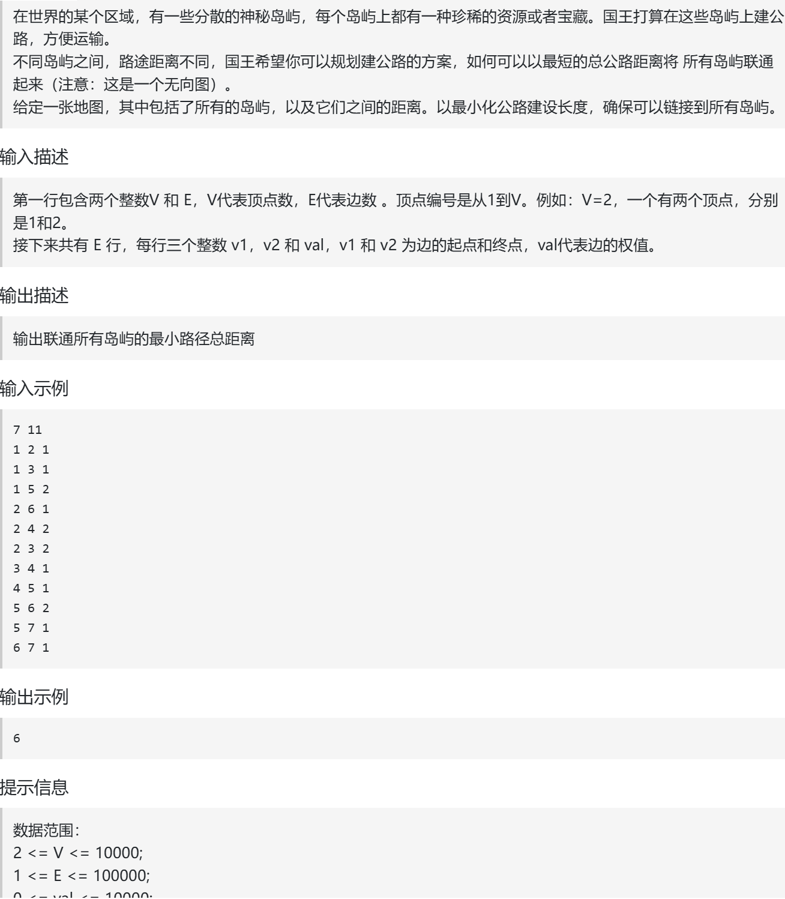
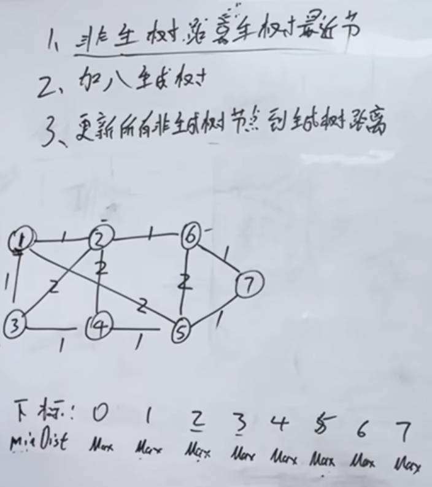
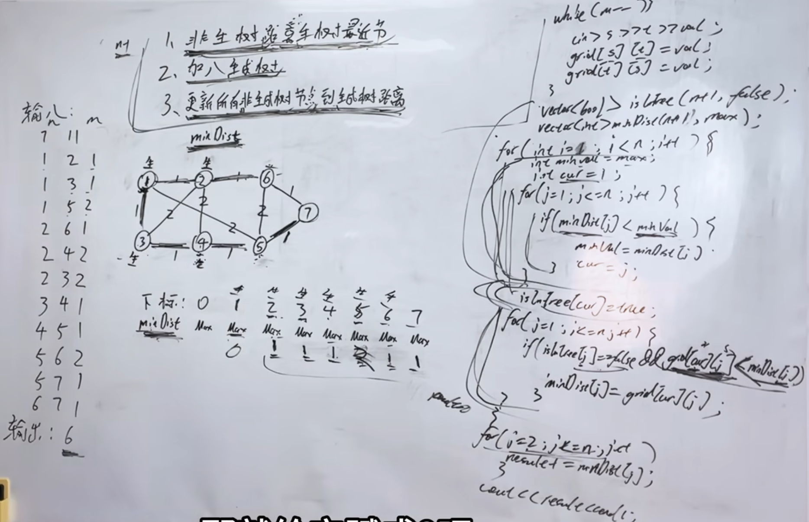

prim算法精讲 

题：https://kamacoder.com/problempage.php?pid=1053  

视频：https://www.bilibili.com/video/BV1gFKVzpExq?vd_source=75999e486c99100a44781daea5d0beae&spm_id_from=333.788.player.switch

https://www.programmercarl.com/kamacoder/0053.%E5%AF%BB%E5%AE%9D-prim.html  






## 三步曲
1.选非生成树中，距离生成树最近的节点  
2.加入生成树  
3.更新所有非生成树节点到生成树距离  
>minDist
### 代码
```python
# 接收输入
v, e = list(map(int, input().strip().split()))
# 按照常规的邻接矩阵存储图信息，不可达的初始化为10001
graph = [[10001] * (v+1) for _ in range(v+1)]
for _ in range(e):
    x, y, w = list(map(int, input().strip().split()))
    #无向图[x][y]，[y][x]
    graph[x][y] = w
    graph[y][x] = w

# 定义加入生成树的标记数组和未加入生成树的最近距离
visited = [False] * (v + 1)
minDist = [10001] * (v + 1)

# 循环 n - 1 次，建立 n - 1 条边
# 从节点视角来看：每次选中一个节点加入树，更新剩余的节点到树的最短距离，
# 这一步其实蕴含了确定下一条选取的边，计入总路程 ans 的计算
for _ in range(1, v + 1):
    min_val = 10002
    cur = -1
    for j in range(1, v + 1):
        if visited[j] == False and minDist[j] < min_val:
            cur = j
            min_val = minDist[j]
    visited[cur] = True
    for j in range(1, v + 1):
        if visited[j] == False and minDist[j] > graph[cur][j]:
            minDist[j] = graph[cur][j]

ans = 0
for i in range(2, v + 1):
    ans += minDist[i]
print(ans)
```