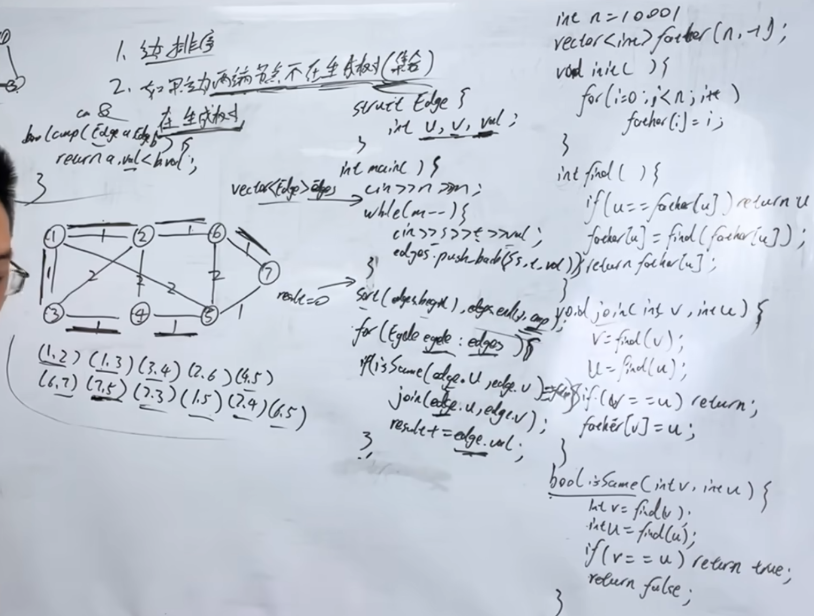

kruskal算法精讲

https://www.programmercarl.com/kamacoder/0053.%E5%AF%BB%E5%AE%9D-Kruskal.html

视频：https://www.bilibili.com/video/BV1GD3uz8EY4?vd_source=75999e486c99100a44781daea5d0beae&spm_id_from=333.788.player.switch  

https://kamacoder.com/problempage.php?pid=1053


## 思路
1.对边排序  
2.如果边两端的节点不在生成树里，就纳入  
  在生成树里，就不用

```python
class Edge:
    def __init__(self, l, r, val):
        self.l = l
        self.r = r
        self.val = val

n = 10001
father = list(range(n))

def init():
    global father
    father = list(range(n))

def find(u):
    if u != father[u]:
        father[u] = find(father[u])
    return father[u]

def join(u, v):
    u = find(u)
    v = find(v)
    if u != v:
        father[v] = u

def kruskal(v, edges):
    edges.sort(key=lambda edge: edge.val)
    init()
    result_val = 0

    for edge in edges:
        x = find(edge.l)
        y = find(edge.r)
        if x != y:
            result_val += edge.val
            join(x, y)

    return result_val

if __name__ == "__main__":
    import sys
    input = sys.stdin.read
    data = input().split()

    v = int(data[0])
    e = int(data[1])

    edges = []
    index = 2
    for _ in range(e):
        v1 = int(data[index])
        v2 = int(data[index + 1])
        val = int(data[index + 2])
        edges.append(Edge(v1, v2, val))
        index += 3

    result_val = kruskal(v, edges)
    print(result_val)
```

