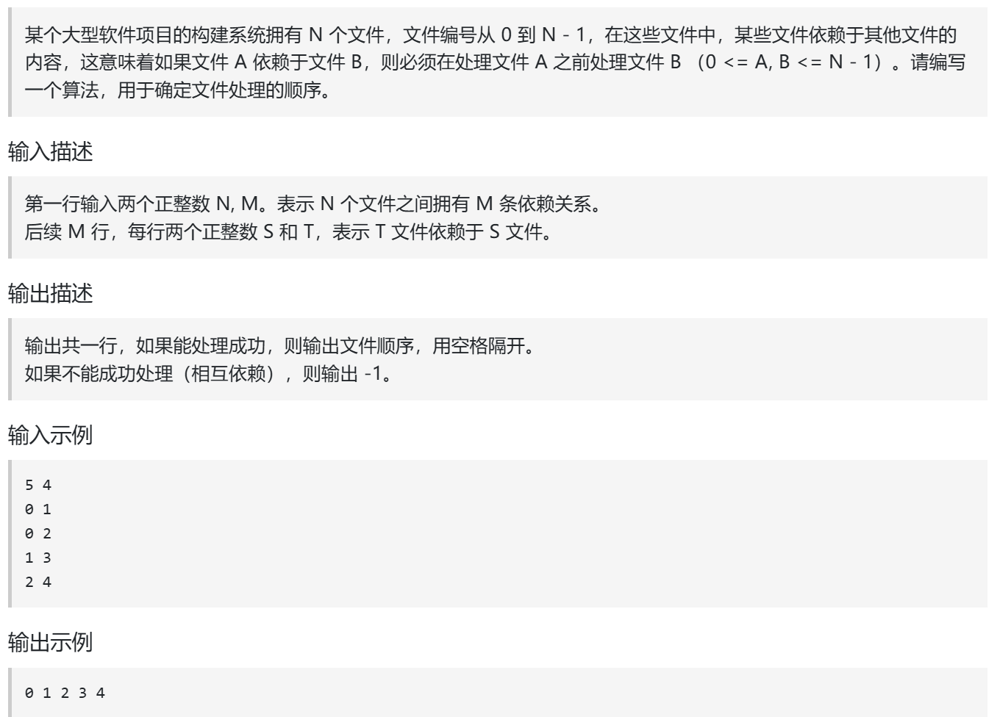
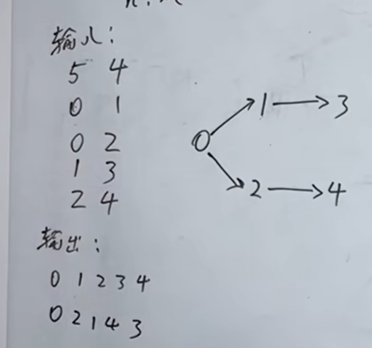
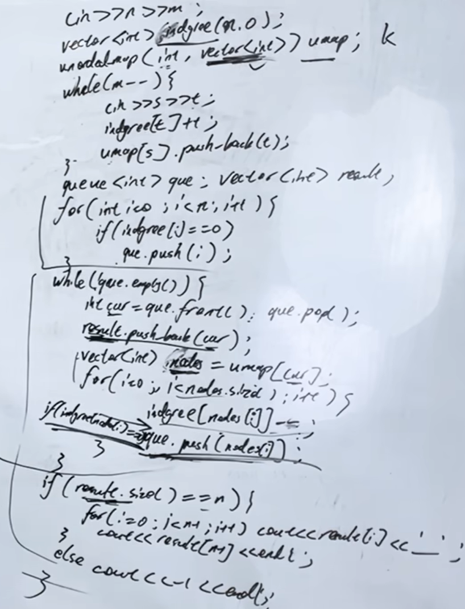

拓扑排序看上去很复杂，其实了解其原理之后，代码不难

https://www.programmercarl.com/kamacoder/0117.%E8%BD%AF%E4%BB%B6%E6%9E%84%E5%BB%BA.html

视频：https://www.bilibili.com/video/BV1czGJzkERe/?vd_source=75999e486c99100a44781daea5d0beae  

卡码网：https://kamacoder.com/problempage.php?pid=1191





## 思路
循环执行：  
1.找入度为0的节点  
2.删节点



```python
from collections import deque, defaultdict

def topological_sort(n, edges):
    inDegree = [0] * n # inDegree 记录每个文件的入度
    umap = defaultdict(list) # 记录文件依赖关系

    # 构建图和入度表
    for s, t in edges:
        inDegree[t] += 1
        umap[s].append(t)

    # 初始化队列，加入所有入度为0的节点
    queue = deque([i for i in range(n) if inDegree[i] == 0])
    result = []

    while queue:
        cur = queue.popleft()  # 当前选中的文件
        result.append(cur)
        for file in umap[cur]:  # 获取该文件指向的文件
            inDegree[file] -= 1  # cur的指向的文件入度-1
            if inDegree[file] == 0:
                queue.append(file)

    if len(result) == n:
        print(" ".join(map(str, result)))
    else:
        print(-1)


if __name__ == "__main__":
    n, m = map(int, input().split())
    edges = [tuple(map(int, input().split())) for _ in range(m)]
    topological_sort(n, edges)
```