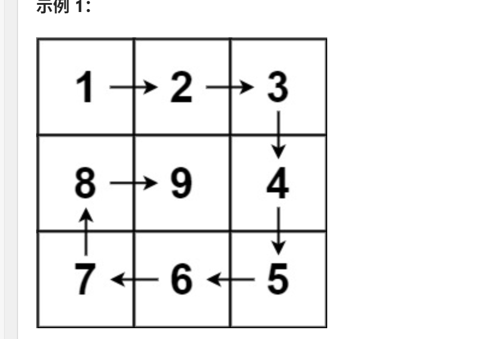

https://leetcode.cn/problems/spiral-matrix/description/
## 学习总结：
1.循环不变量：每条变都需要按照相同的规则遍历  
2.用矩阵方式`num[i][j]`去遍历,即可控制循环：

3.用`starti``offset`等去控制每一环的起始、终止  

    四个顶点都是动的：
    for j in range(start_j,n-offset)
 

4.需要n为奇、偶分别讨论

https://leetcode.cn/problems/spiral-matrix/