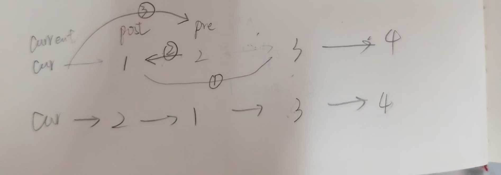

https://programmercarl.com/0024.%E4%B8%A4%E4%B8%A4%E4%BA%A4%E6%8D%A2%E9%93%BE%E8%A1%A8%E4%B8%AD%E7%9A%84%E8%8A%82%E7%82%B9.html#%E6%80%9D%E8%B7%AF

<mark>老是错!</mark>

1.需要头结点：不用单独讨论空头的情况  
2.指针调整的顺序：（<mark>模拟</mark>一遍思路）

```python
post.next =pre.next  #最先改变的
current.next=pre
pre.next=post
```
3.`post.next =pre.next   #!pre一个指针，可以用来指两个位置`