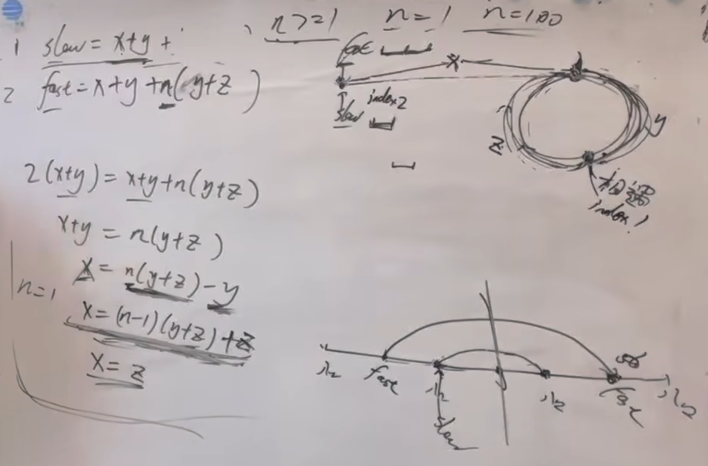

https://programmercarl.com/0142.%E7%8E%AF%E5%BD%A2%E9%93%BE%E8%A1%A8II.html

## 原理思路（！自己推一遍）


## 出现的问题
```python
# 2.fast!=slow 有问题：初始条件就是fast==slow，直接不执行！
 while fast and fast!=slow:  #1.fast要先判空 
    fast=fast.next.next
    slow=slow.next

```

