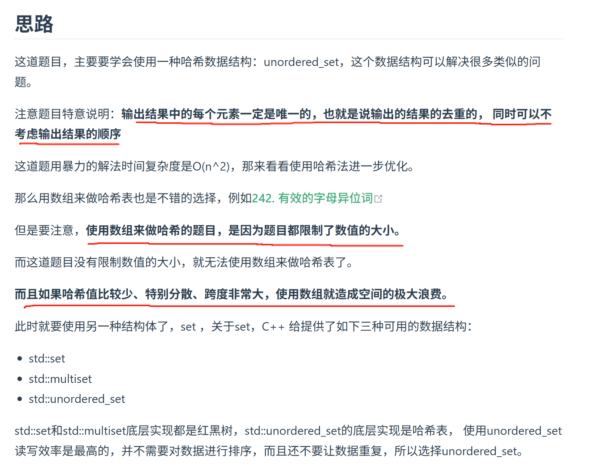
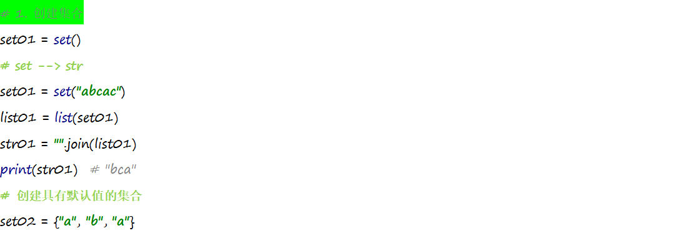
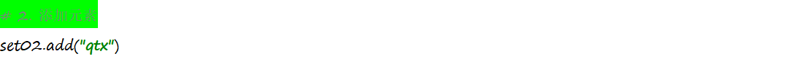
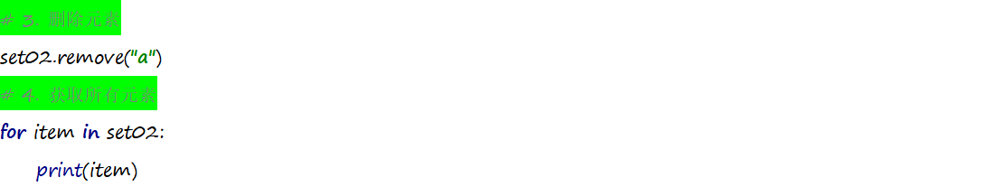
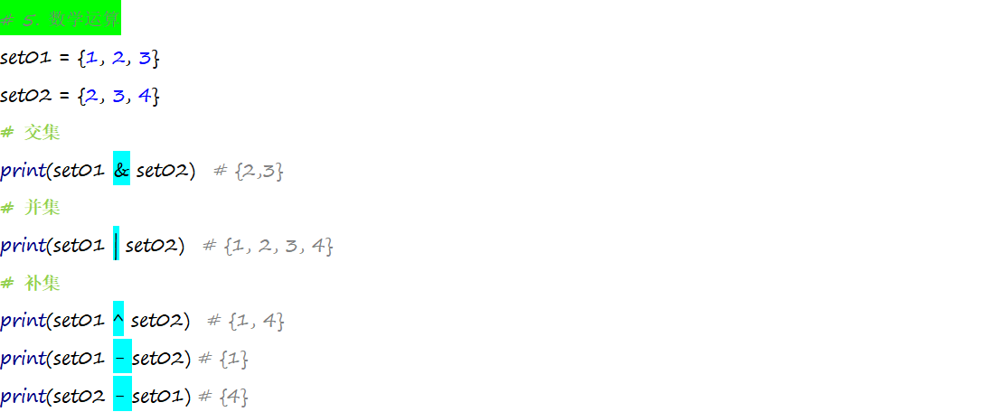

https://programmercarl.com/0349.%E4%B8%A4%E4%B8%AA%E6%95%B0%E7%BB%84%E7%9A%84%E4%BA%A4%E9%9B%86.html  

## 经验总结
1.<mark>什么时候用set 什么时候用数组：</mark>元素唯一 用set

## 复习--集合
### 1.定义
1.由一系列不重复的不可变类型变量组成的可变映射容器。
2.相当于只有键没有值的字典(键则是集合的数据)。

### 2.创建

### 3.增、删、查

### 4.集合推导式

1. 定义：

使用简易方法，将可迭代对象转换为集合。

2. 语法:

{表达式 for 变量 in 可迭代对象}

{表达式 for 变量 in 可迭代对象 if 条件}
