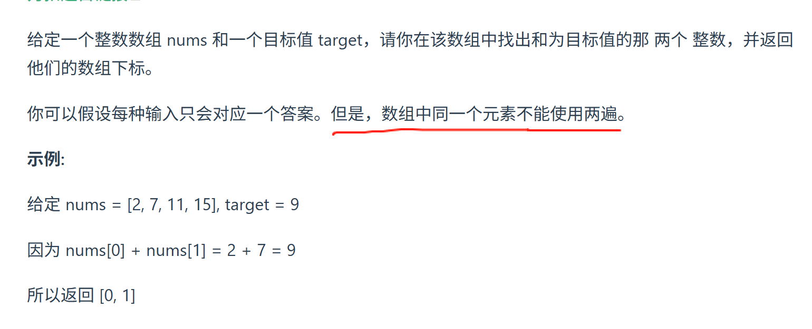

https://programmercarl.com/0001.%E4%B8%A4%E6%95%B0%E4%B9%8B%E5%92%8C.html#%E6%80%9D%E8%B7%AF

## 遇到的问题
1.根据题意，可以用map解题！

<mark>**思路：**</mark>  
1.**为什么会想到用哈希表**：需要看目标元素是否在遍历过的集合中存在  
2.**为什么会想到用map**：需要存两个值，①数值 ②索引
