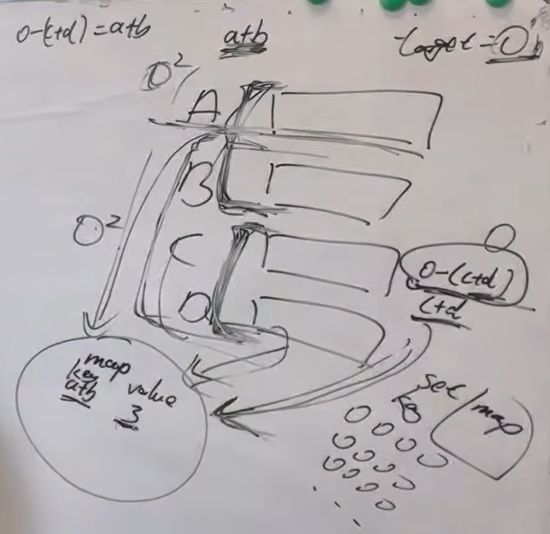

https://programmercarl.com/0454.%E5%9B%9B%E6%95%B0%E7%9B%B8%E5%8A%A0II.html#%E7%AE%97%E6%B3%95%E5%85%AC%E5%BC%80%E8%AF%BE   

经典题目

**建议**：本题是 使用map 巧妙解决的问题，好好体会一下 哈希法 如何提高程序执行效率，降低时间复杂度，当然使用哈希法 会提高空间复杂度，但一般来说我们都是舍空间 换时间， 工业开发也是这样。

## 思路

1.0-(c+d)=a+b

## 复习
字典的操作