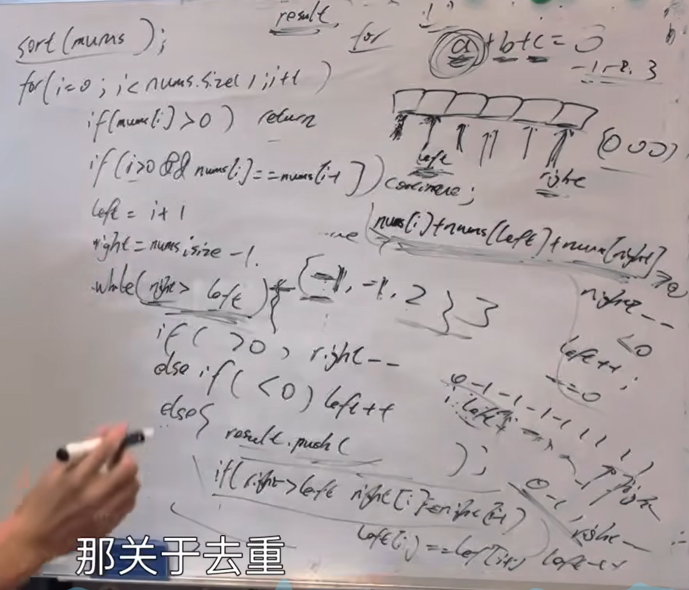

https://programmercarl.com/0015.%E4%B8%89%E6%95%B0%E4%B9%8B%E5%92%8C.html

<font color=red>▲</font>（多练几遍）

建议：本题虽然和 两数之和 很像，也能用哈希法，但用哈希法会很麻烦，双指针法才是正解，可以先看视频理解一下 双指针法的思路，文章中讲解的，没问题 哈希法很麻烦。 

 ## 思路
1.排序
2.
```python
if nums[i]>0:   #!
    return []
```

3.去重(难点)  

对比为什么不用nums[i]==nums[i+1] :
- 用i+1首次出现也不会记录进结果
```python
if i>0 and nums[i]==nums[i-1]: #!去重
    continue
```

**重点**：<font color=red>如何去重(两处)</font>
