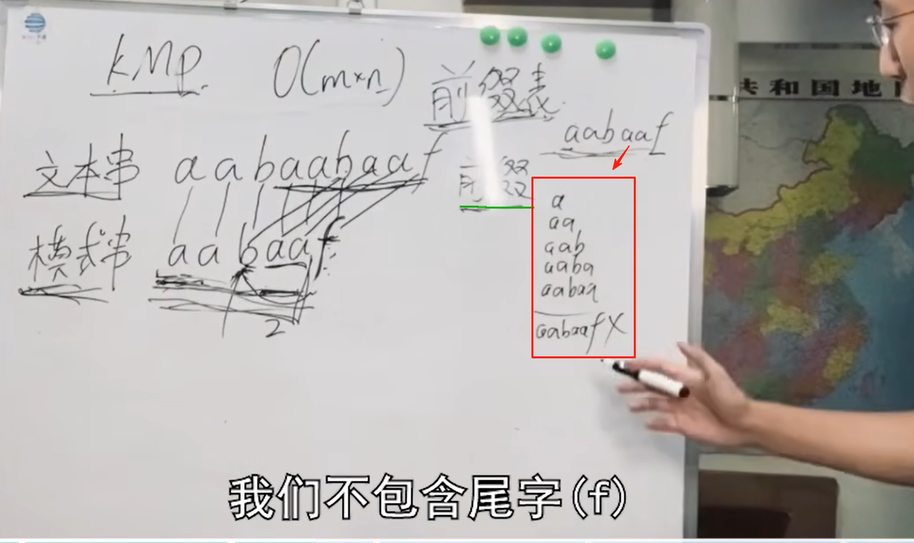
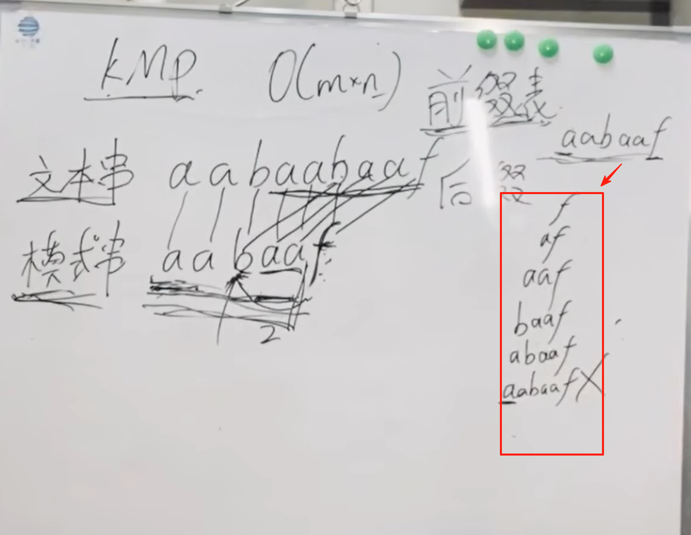
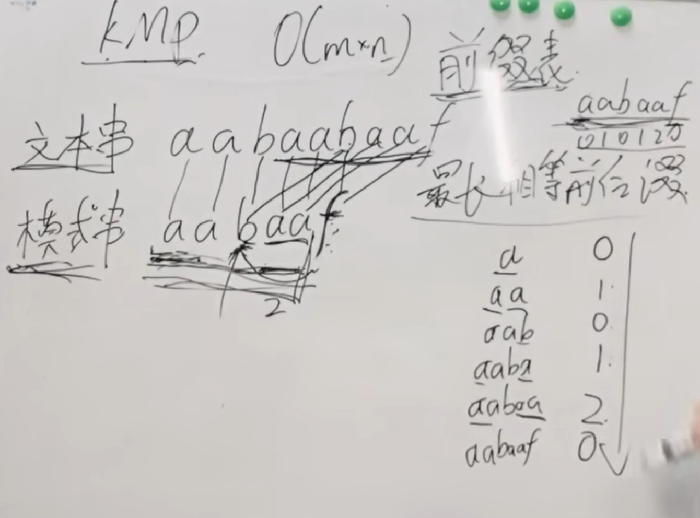
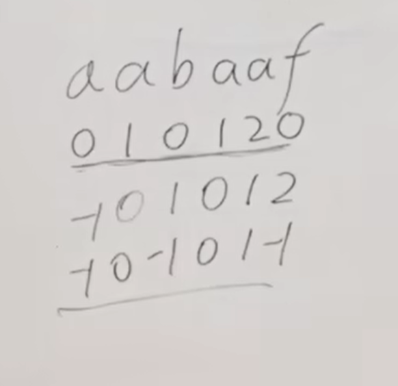
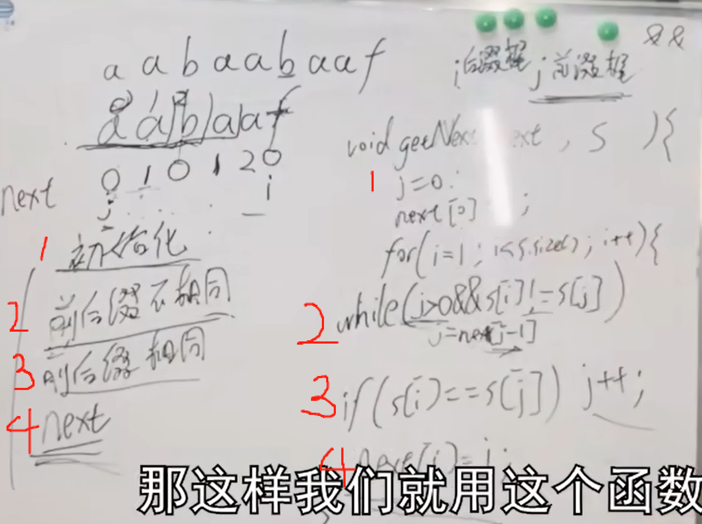

**建议**；因为KMP算法很难，大家别奢求 一次就把kmp全理解了，大家刚学KMP一定会有各种各样的疑问，先留着，别期望立刻啃明白，第一遍了解大概思路，二刷的时候，再看KMP会 好懂很多。

或者说大家可以放弃一刷可以不看KMP，今天来回顾一下之前的算法题目就可以。

因为大家 算法能力还没到，细扣 很难的算法，会把自己绕进去，就算别人给解释，只会激发出更多的问题和疑惑。所以大家先了解大体过程，知道这么回事， 等自己有 算法基础和思维了，在看多看几遍视频，慢慢就理解了。

https://programmercarl.com/0028.%E5%AE%9E%E7%8E%B0strStr.html#%E7%AE%97%E6%B3%95%E5%85%AC%E5%BC%80%E8%AF%BE

## 复习
### KMP算法
1.前缀：所有包含首字母，不包含尾字母的子串

2.后缀：所有包含尾字母，不包含首字母的子串

3.最长相等前后缀
 

4.next数组

5.代码求next数组  
遇见了冲突的位置要向前回退  
<mark>
j：指向前缀末尾位置（同时还有含义：i之前包括i的子串的最长相等前后缀的长度）  
i：指向后缀末尾位置
</mark>
