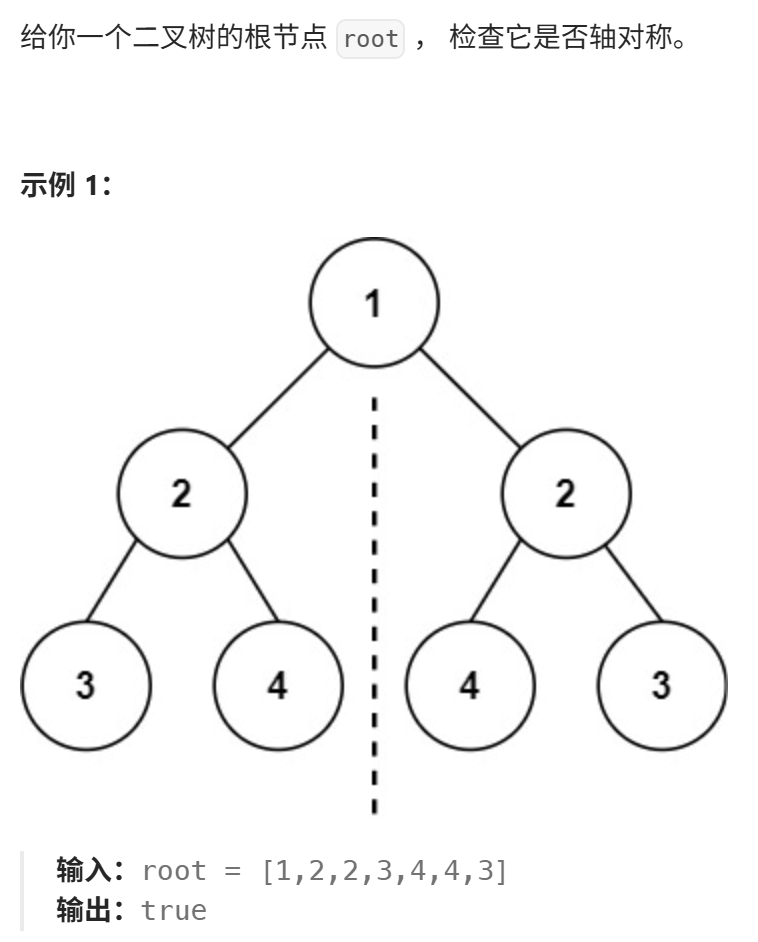
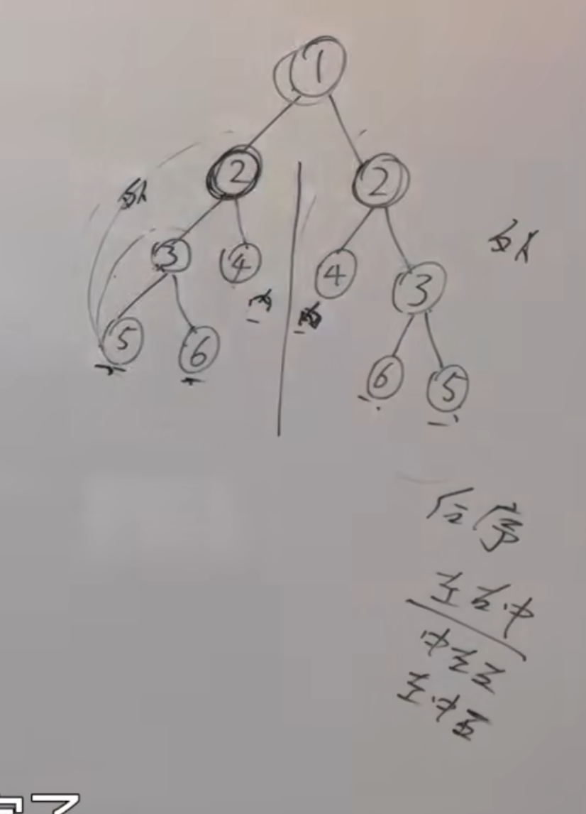
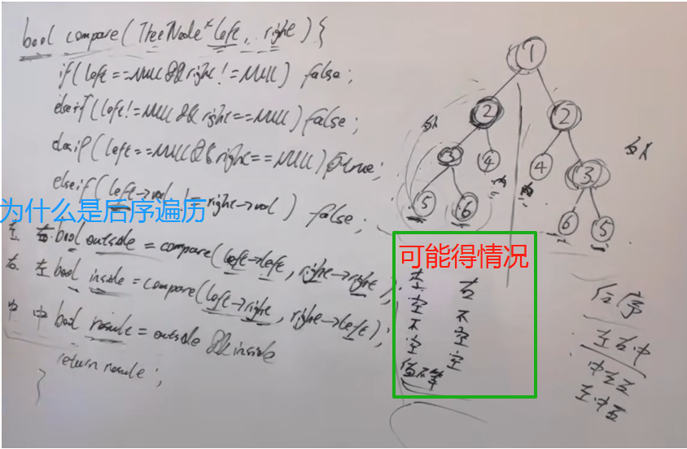

https://programmercarl.com/0101.%E5%AF%B9%E7%A7%B0%E4%BA%8C%E5%8F%89%E6%A0%91.html  

## 经验总结
### 为什么只能用后序遍历（思考）
左 右 中

### 本质：
- 判断两个二叉树是否是相互翻转的
- 同时比较两个二叉树里面对应节点的情况

## 思路
  
- 为什么是后序：  
只有外侧对称，内侧对称，才能告诉父节点是对撑的  

### 关键
- 判断是否是对称二叉树，主要看他左右孩子是否可以翻转
- 理解遍历顺序：后序遍历