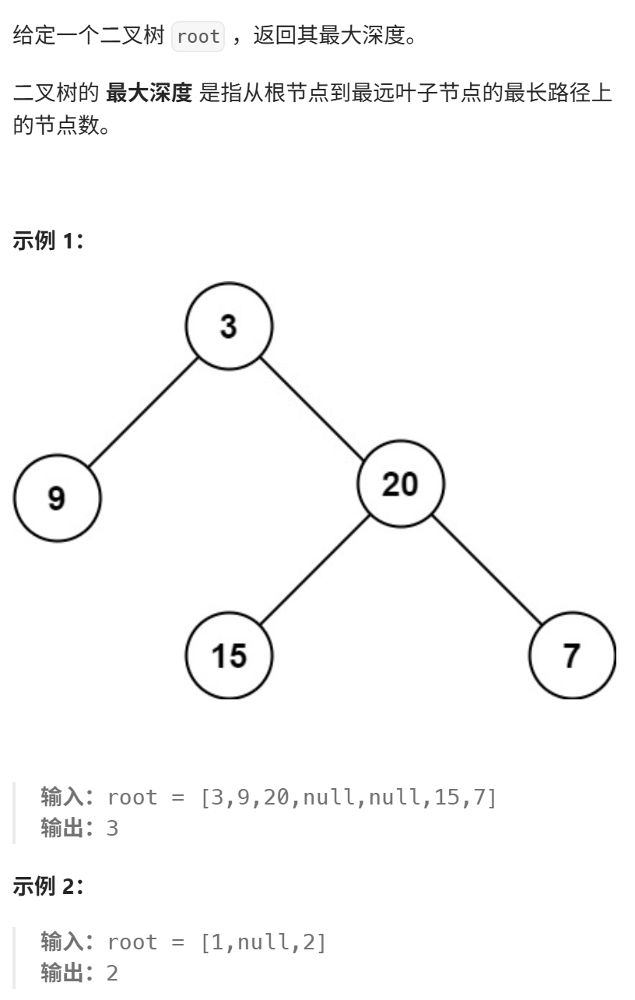
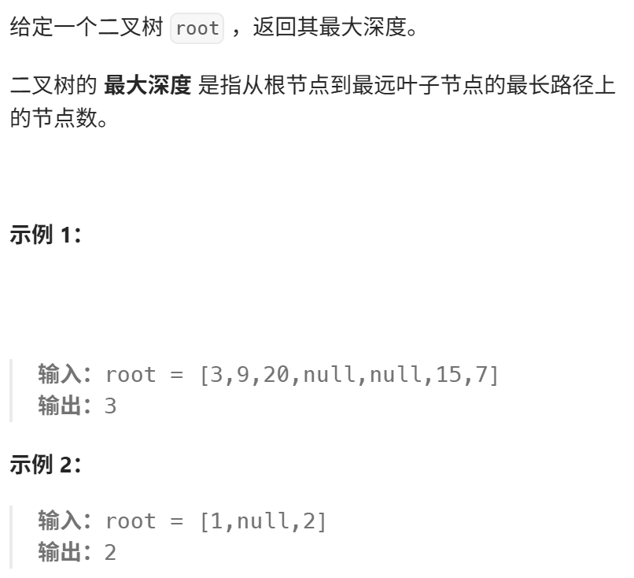

https://programmercarl.com/0104.%E4%BA%8C%E5%8F%89%E6%A0%91%E7%9A%84%E6%9C%80%E5%A4%A7%E6%B7%B1%E5%BA%A6.html#%E7%AE%97%E6%B3%95%E5%85%AC%E5%BC%80%E8%AF%BE  

## 学习总结
1、深度 vs 高度
- 深度：某一节点到根节点的距离（用前序遍历）
- 高度：某一节点到叶子结点的距离（用后序遍历）

2、确定遍历的顺序  
