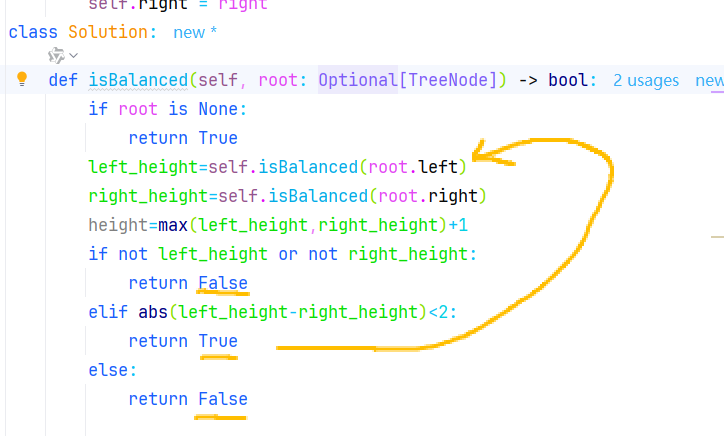

https://programmercarl.com/0110.%E5%B9%B3%E8%A1%A1%E4%BA%8C%E5%8F%89%E6%A0%91.html#%E7%AE%97%E6%B3%95%E5%85%AC%E5%BC%80%E8%AF%BE

## 遇到的问题
返回值是bool，所求值是int，相互矛盾：

解决：
两个函数：isBalanced、get_height

## 经验总结
递归时需要分析清每层的情况