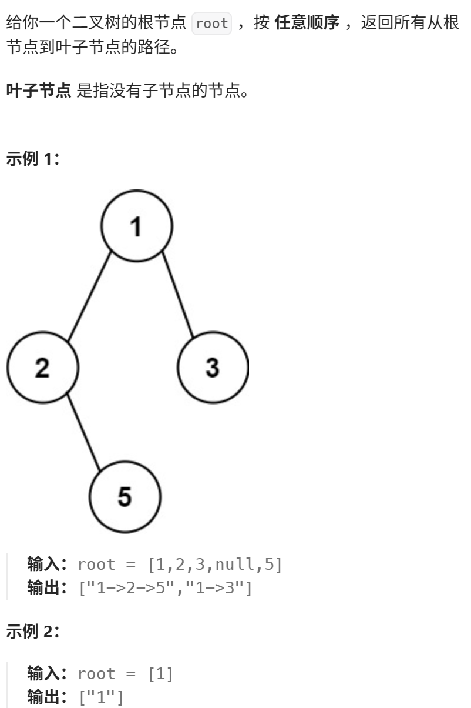
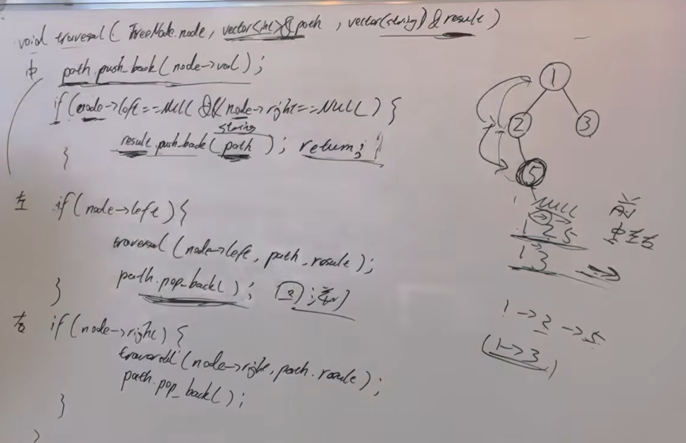

 ▲难题  
 【建议】  
这是大家第一次接触到回溯的过程， 我在视频里重点讲解了 本题为什么要有回溯，已经回溯的过程。 

如果对回溯 似懂非懂，没关系， 可以先有个印象。 
https://programmercarl.com/0257.%E4%BA%8C%E5%8F%89%E6%A0%91%E7%9A%84%E6%89%80%E6%9C%89%E8%B7%AF%E5%BE%84.html#%E7%AE%97%E6%B3%95%E5%85%AC%E5%BC%80%E8%AF%BE  
 

## 思路
1、确定遍历顺序  
2、入参  
3、终止条件  
4、每一层的遍历
- 为什么有回溯

