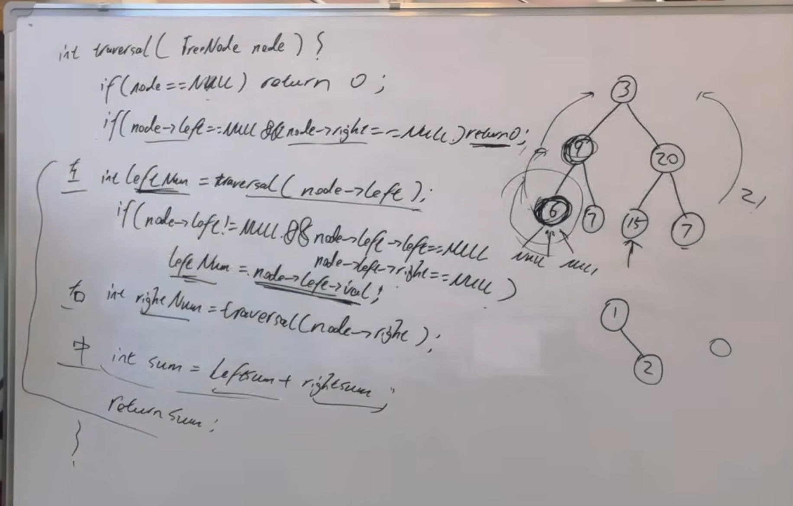

https://programmercarl.com/0404.%E5%B7%A6%E5%8F%B6%E5%AD%90%E4%B9%8B%E5%92%8C.html

<font color=red>▲有问题</font>

## 思路



## 出现的问题
1、返回值没有分析对：用sum
2、遍历顺序没分析对：

3、单层递归的逻辑没理清

```python
class Solution:
    def sumOfLeftLeaves(self, root: Optional[TreeNode]) -> int:
        left_leaves = []
        def get_left_leaves(node:TreeNode):
            if root is None:
                return left_leaves
            if root.left is None:
                return left_leaves

            if node.left!=None and node.left.left==None and node.left.right==None:
                left_leaves.append(node.left.val)
            if node.left!=None and node.left.left !=None:
                get_left_leaves(node.left)
            if node.right!=None and node.right.left!=None:
                get_left_leaves(node.right)

        get_left_leaves(root)
        sum=0
        for num in left_leaves:
            sum+=num
        return sum
``` 


1. **递归终止条件错误**：在 `get_left_leaves` 函数中，判断的是 `root` 是否为 `None`，而不是判断传入的参数 `node` 是否为 `None`

2. **递归调用条件不完整**：只在特定条件下才递归调用，比如 `node.left.left != None`，但实际上应该对所有非叶子节点都进行递归

3. **遗漏了某些情况**：例如当 `node.left` 是左叶子节点时，没有继续检查 `node.right` 的情况

下面是修改后的代码：

```python
class Solution:
    def sumOfLeftLeaves(self, root: Optional[TreeNode]) -> int:
        left_leaves = []
        def get_left_leaves(node: TreeNode):
            # 修正1: 正确使用node参数而不是root
            if node is None:
                return
            
            # 修正2: 正确判断左叶子节点
            if node.left and not node.left.left and not node.left.right:
                left_leaves.append(node.left.val)
            
            # 修正3: 对左右子树都进行递归调用
            get_left_leaves(node.left)
            get_left_leaves(node.right)

        if not root:
            return 0
            
        get_left_leaves(root)
        return sum(left_leaves)  # 修正4: 使用内置sum函数更简洁
```

主要修改点：
- 将函数内的 `root` 改为 `node`，使用正确的参数
- 简化了递归调用的条件，对所有节点都进行递归
- 移除了不必要的提前返回条件
- 使用 `sum()` 函数简化求和操作

这样修改后就能正确计算所有左叶子节点的值之和了。
