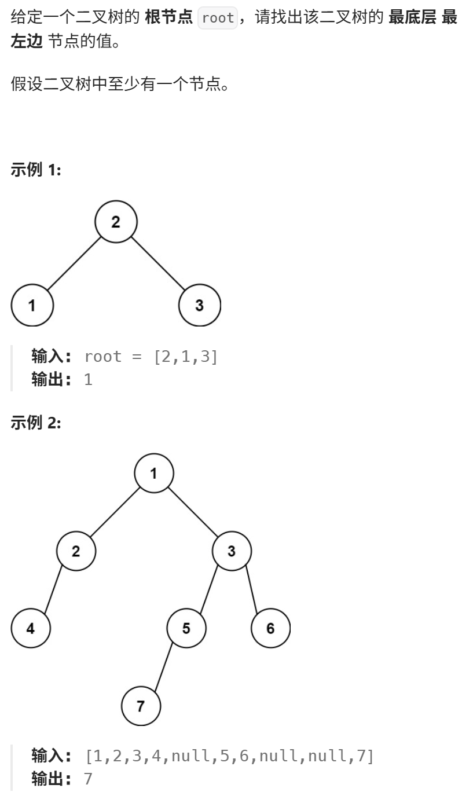
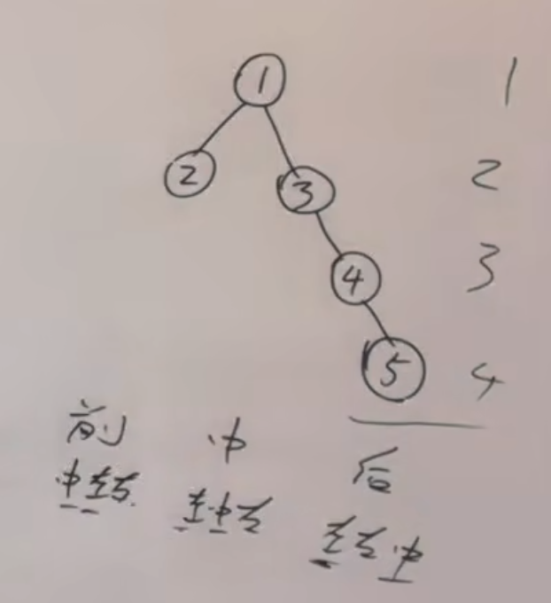
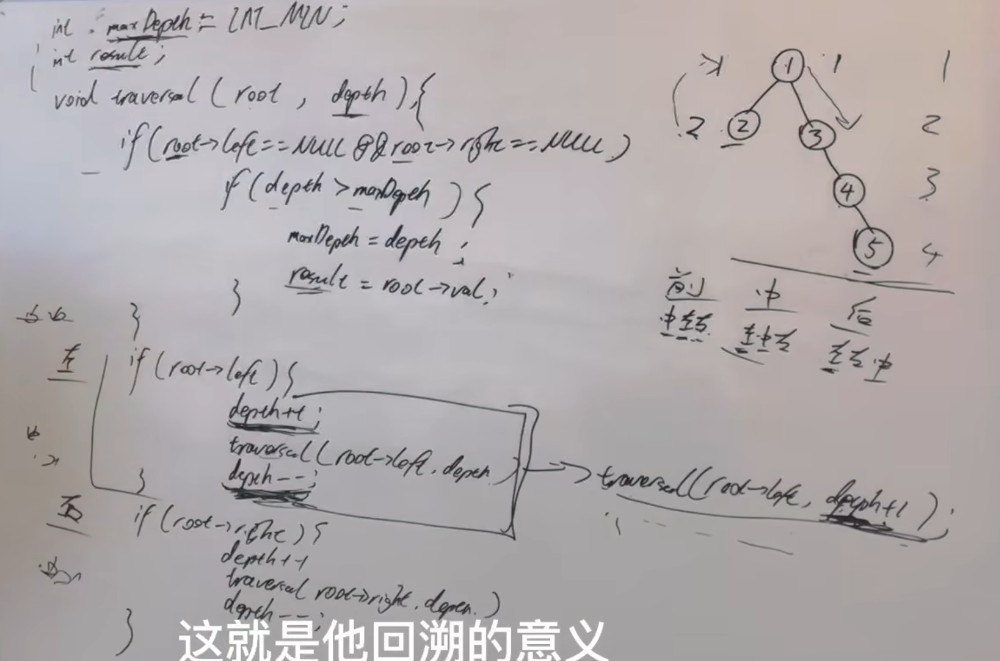

https://programmercarl.com/0513.%E6%89%BE%E6%A0%91%E5%B7%A6%E4%B8%8B%E8%A7%92%E7%9A%84%E5%80%BC.html#%E7%AE%97%E6%B3%95%E5%85%AC%E5%BC%80%E8%AF%BE

**[建议]**  
本题递归偏难，反而迭代简单属于模板题， 两种方法掌握一下 

## 思路
1、如何找到左下角  
>无论是前序、中序、后序遍历，都没有对中的处理，最开始处理的就是“左”

