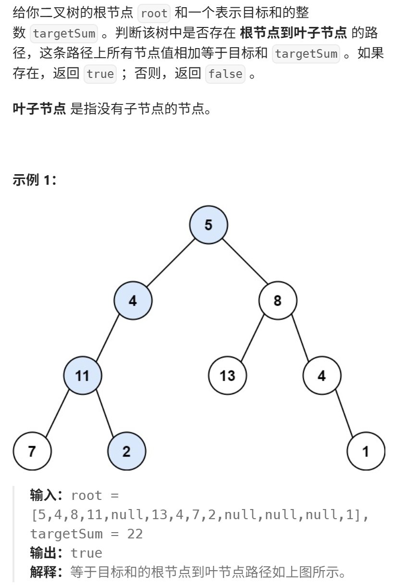
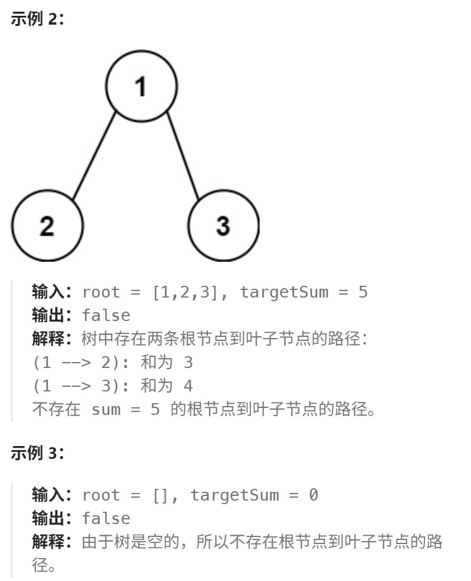

**[建议]**  
本题 又一次涉及到回溯的过程，而且回溯的过程隐藏的还挺深，建议先看视频来理解 

112. 路径总和，和 113. 路径总和ii 一起做了。 优先掌握递归法。

https://programmercarl.com/0112.%E8%B7%AF%E5%BE%84%E6%80%BB%E5%92%8C.html#%E7%AE%97%E6%B3%95%E5%85%AC%E5%BC%80%E8%AF%BE

