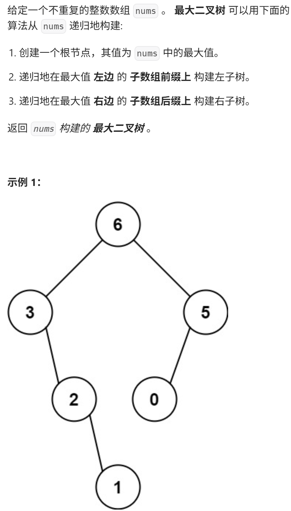
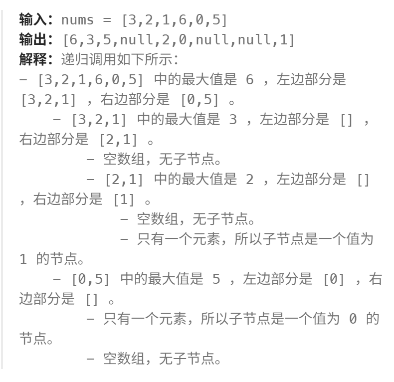
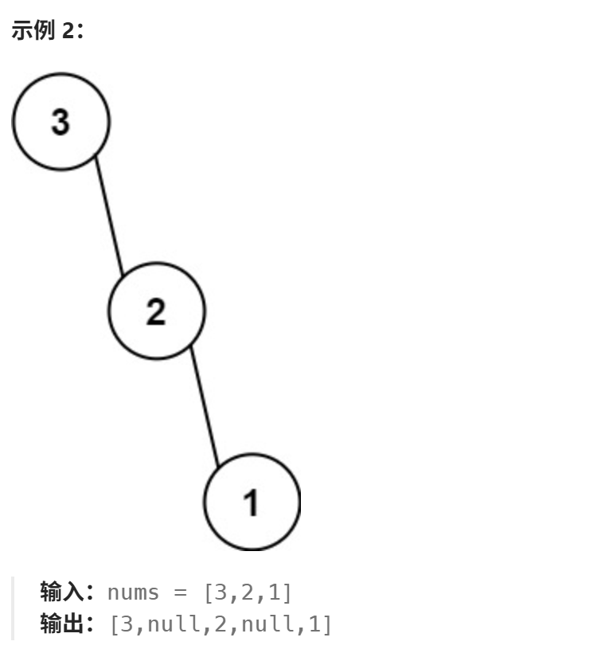

**[建议]**
又是构造二叉树，昨天大家刚刚做完 中序后序确定二叉树，今天做这个 应该会容易一些， 先看视频，好好体会一下 为什么构造二叉树都是 前序遍历 

https://programmercarl.com/0654.%E6%9C%80%E5%A4%A7%E4%BA%8C%E5%8F%89%E6%A0%91.html#%E7%AE%97%E6%B3%95%E5%85%AC%E5%BC%80%E8%AF%BE  

## 经验总结
if nums is None:  vs  if not nums:  
>**区别对比**  
**if nums is None:**   
· 只检查  nums 是否为 None  
· 不检查空列表 []    
**if not nums:**  
· 检查所有"假值"(falsy values)  
· 包括：None、[]、0、""、False 等  