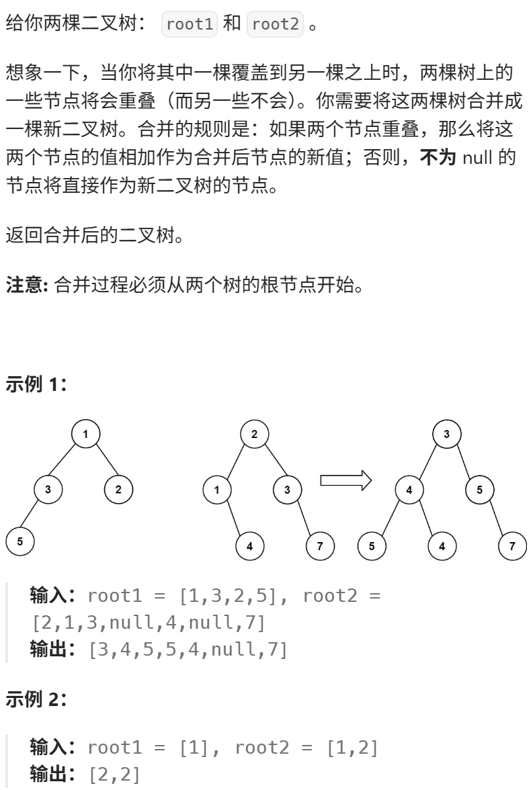
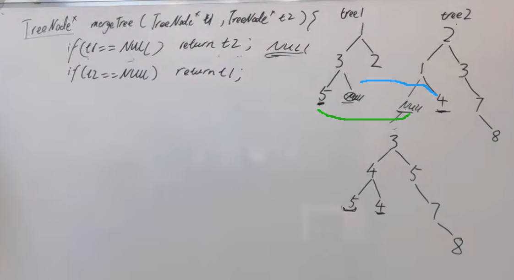

【建议】 对比判别是不是对称二叉树  
这次是一起**操作两个二叉树**了， 估计大家也没一起操作过两个二叉树，也不知道该如何一起操作，可以看视频先理解一下。 优先掌握递归。

https://programmercarl.com/0617.%E5%90%88%E5%B9%B6%E4%BA%8C%E5%8F%89%E6%A0%91.html#%E7%AE%97%E6%B3%95%E5%85%AC%E5%BC%80%E8%AF%BE  

## 思路
1、确定传入的参数和返回值  
2、终止条件：
 > 

3、不创建新树，直接在tree1上修改（空间复杂度减少）
