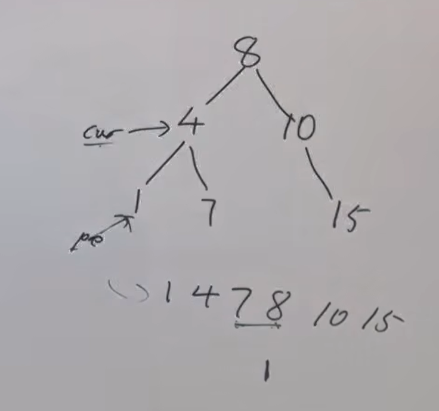
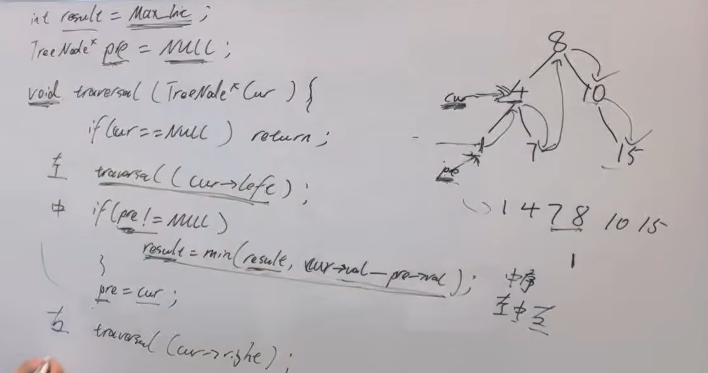

【建议】  
需要领悟一下二叉树遍历上双指针操作，优先掌握递归 
https://programmercarl.com/0530.%E4%BA%8C%E5%8F%89%E6%90%9C%E7%B4%A2%E6%A0%91%E7%9A%84%E6%9C%80%E5%B0%8F%E7%BB%9D%E5%AF%B9%E5%B7%AE.html  
 
## 思路
1、中序遍历->相邻两个元素的差  
2、双指针

