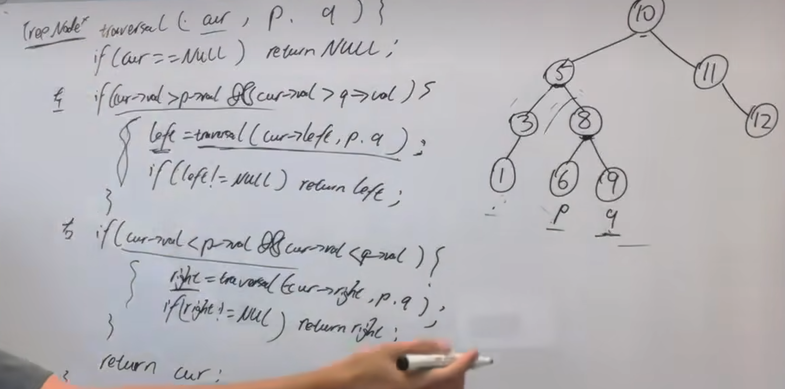

【建议】
相对于 二叉树的最近公共祖先 本题就简单一些了，因为 可以利用二叉搜索树的特性  

https://programmercarl.com/0235.%E4%BA%8C%E5%8F%89%E6%90%9C%E7%B4%A2%E6%A0%91%E7%9A%84%E6%9C%80%E8%BF%91%E5%85%AC%E5%85%B1%E7%A5%96%E5%85%88.html#%E7%AE%97%E6%B3%95%E5%85%AC%E5%BC%80%E8%AF%BE  

## 思路
遇到的第一个，介于p和q之间的数就是最近公共祖先
>原因：此时p一定在左边，q一定在右边，不论向哪边遍历，都会导致不是错过了p就是错过了q
