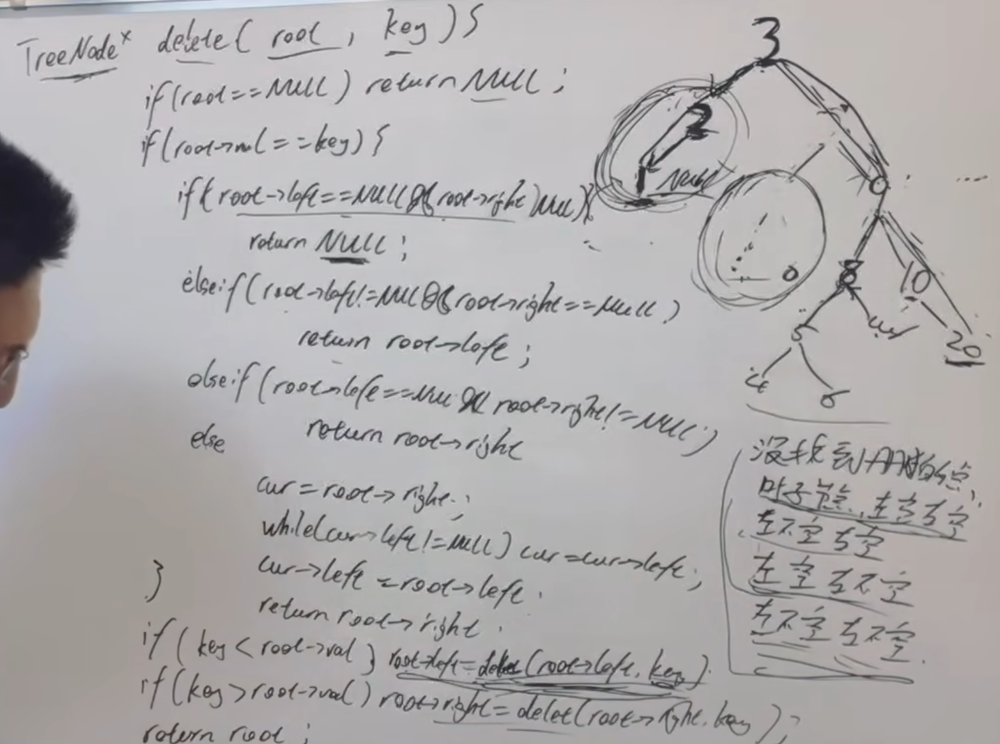

https://programmercarl.com/0450.%E5%88%A0%E9%99%A4%E4%BA%8C%E5%8F%89%E6%90%9C%E7%B4%A2%E6%A0%91%E4%B8%AD%E7%9A%84%E8%8A%82%E7%82%B9.html#%E7%AE%97%E6%B3%95%E5%85%AC%E5%BC%80%E8%AF%BE  

## 思路
1、分析5种情况
>①没找到要删除的结点  
> ②删除的是叶子节点  
> ③左不空右空  
> ④左空右不空  
> ⑤左不空右不空

2、每种情况是如何调节BST的
3、确定参数和返回值
>返回：改变后的根节点

4、▲终止条件：找到要删的节点，删除的具体操作在终止条件里  

