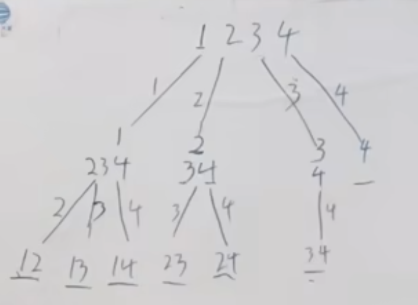
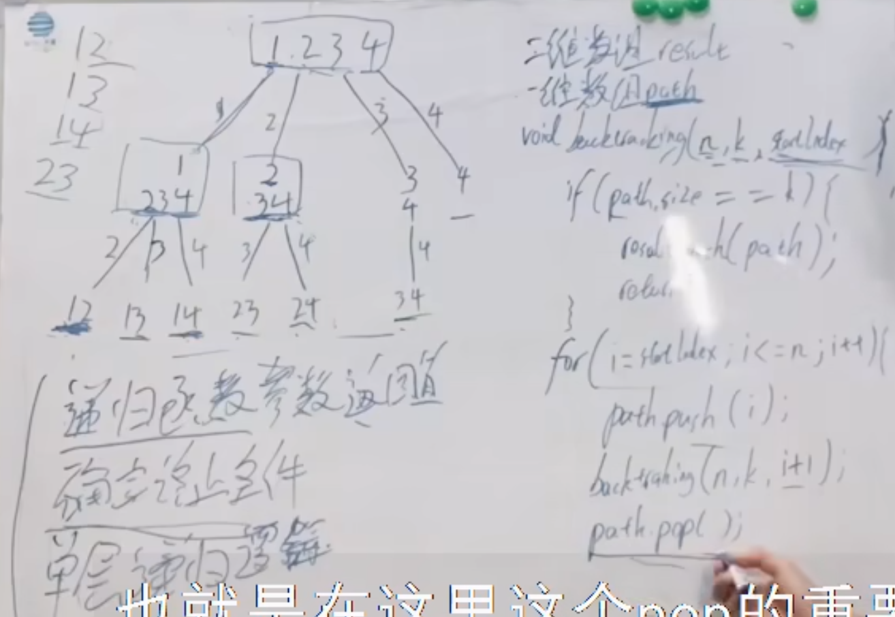
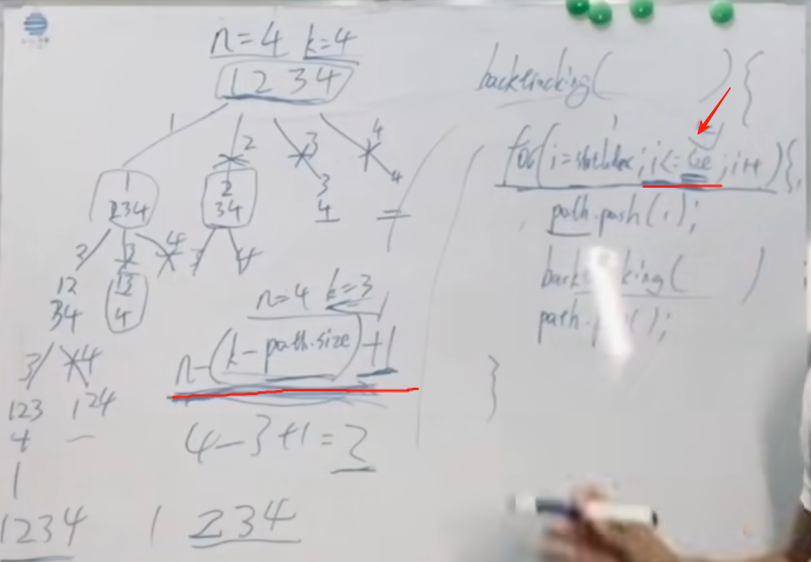

对着 在 回溯算法理论基础 给出的 代码模板，来做本题组合问题，大家就会发现 写回溯算法套路。

在回溯算法解决实际问题的过程中，大家会有各种疑问，先看视频介绍，基本可以解决大家的疑惑。

本题关于剪枝操作是大家要理解的重点，因为后面很多回溯算法解决的题目，都是这个剪枝套路。 

题目链接/文章讲解：https://programmercarl.com/0077.%E7%BB%84%E5%90%88.html   
视频讲解：https://www.bilibili.com/video/BV1ti4y1L7cv 
剪枝操作：https://www.bilibili.com/video/BV1wi4y157er   

## 思路
 
 
 
### 剪枝
