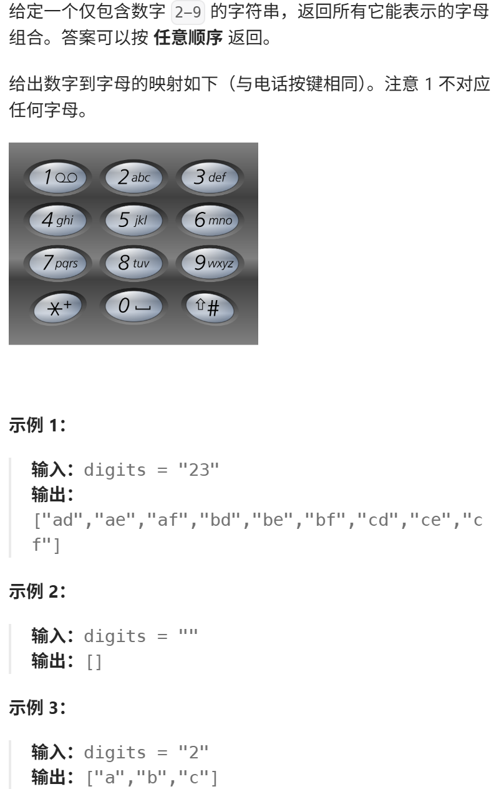
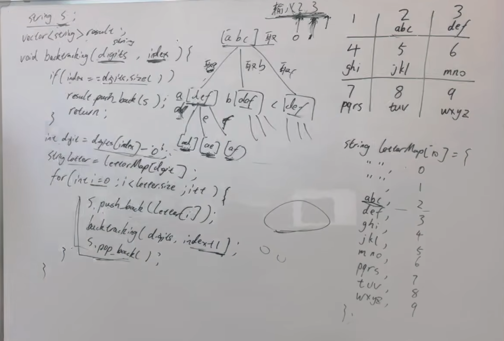

本题大家刚开始做会有点难度，先自己思考20min，没思路就直接看题解。 

题目链接/文章讲解：https://programmercarl.com/0017.%E7%94%B5%E8%AF%9D%E5%8F%B7%E7%A0%81%E7%9A%84%E5%AD%97%E6%AF%8D%E7%BB%84%E5%90%88.html   
视频讲解：https://www.bilibili.com/video/BV1yV4y1V7Ug

## 思路
