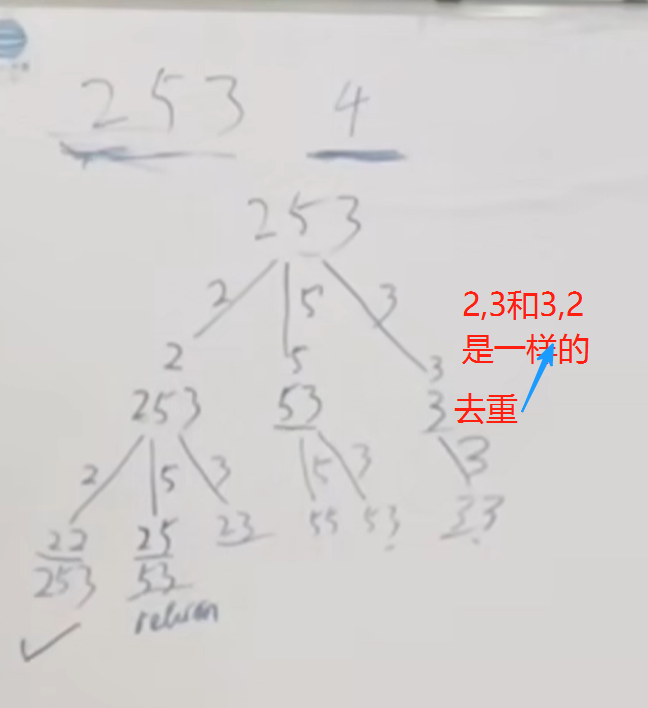
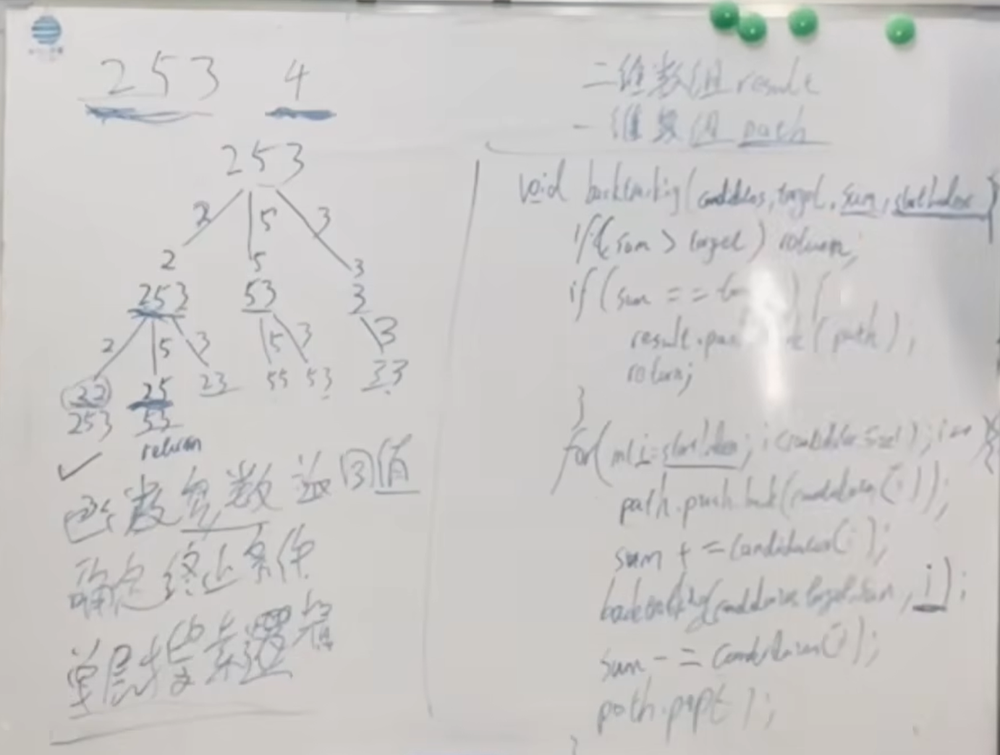

本题是 集合里元素可以用无数次，那么和组合问题的差别 其实仅在于 startIndex上的控制

题目链接/文章讲解：https://programmercarl.com/0039.%E7%BB%84%E5%90%88%E6%80%BB%E5%92%8C.html 
视频讲解：https://www.bilibili.com/video/BV1KT4y1M7HJ 

## 思路

>· 确定参数、返回值  
> · 确定终止条件  
> · 单层搜索逻辑  
>  
### 剪枝
排序：如果总和大于targ，后面就没有必要遍历了
