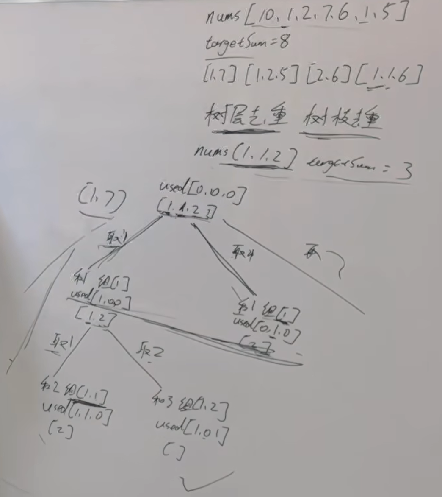
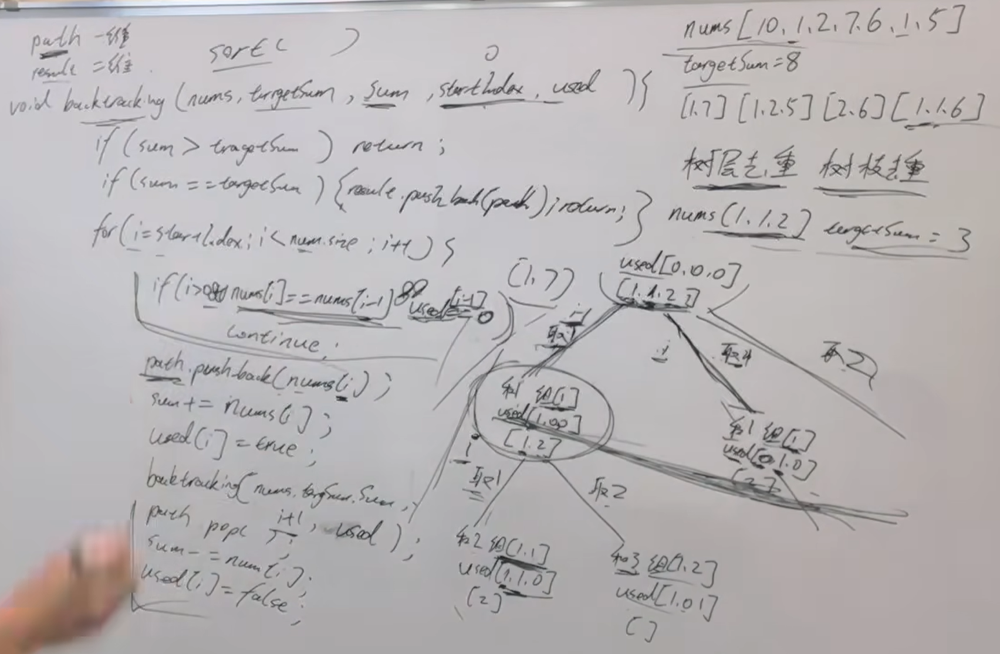

本题开始涉及到一个问题了：去重。

注意题目中给我们 集合是有重复元素的，那么求出来的 组合有可能重复，但题目要求不能有重复组合。 

题目链接/文章讲解：https://programmercarl.com/0040.%E7%BB%84%E5%90%88%E6%80%BB%E5%92%8CII.html   
视频讲解：https://www.bilibili.com/video/BV12V4y1V73A

## 思路
树层去重，树枝不用去重

