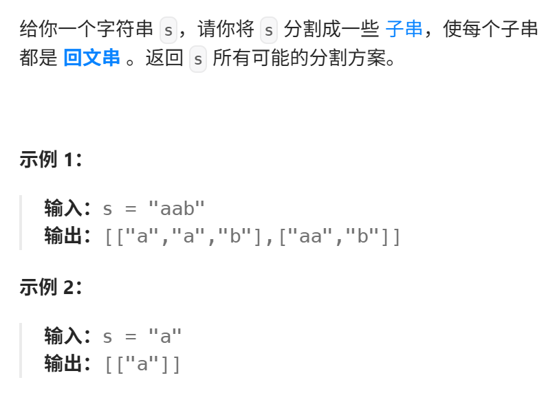
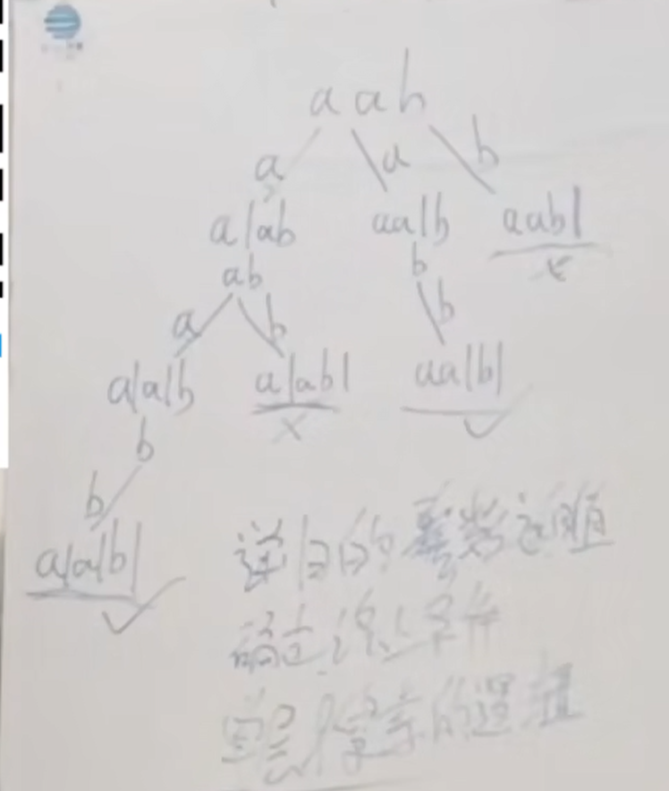

本题较难，大家先看视频来理解 分割问题，明天还会有一道分割问题，先打打基础。 

https://programmercarl.com/0131.%E5%88%86%E5%89%B2%E5%9B%9E%E6%96%87%E4%B8%B2.html  
视频讲解：https://www.bilibili.com/video/BV1c54y1e7k6  

## 思路

start_index就是切割线  
子串范围`[start_index,i]`