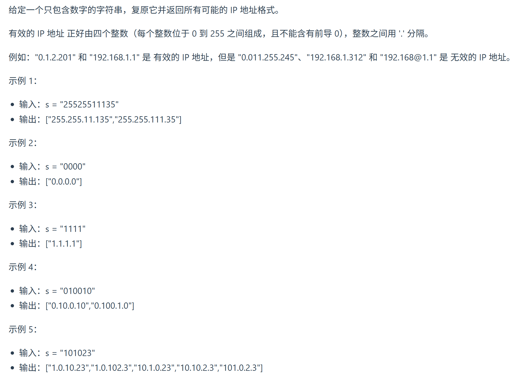
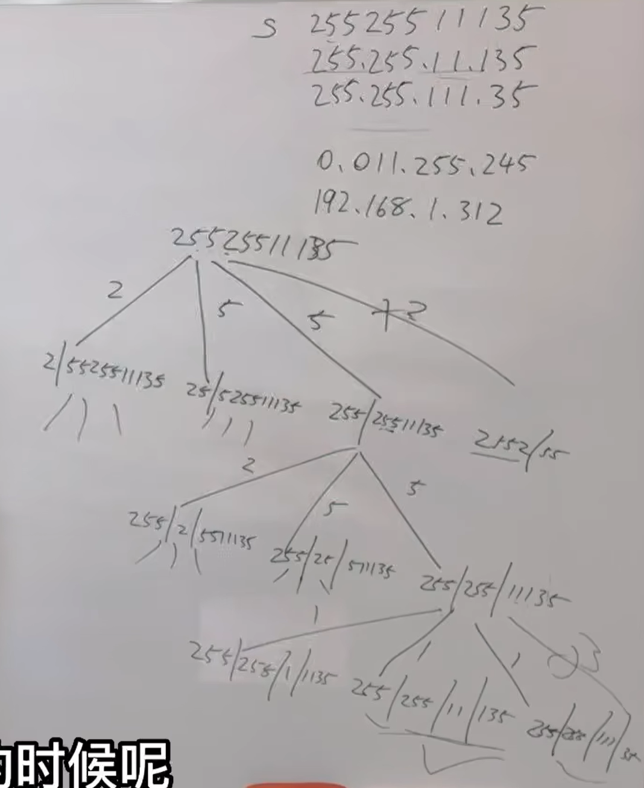
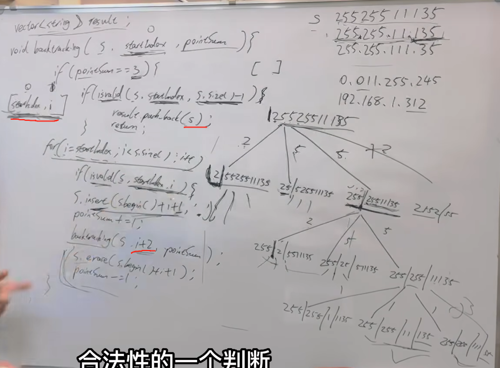

本期本来是很有难度的，不过 大家做完 分割回文串 之后，本题就容易很多了 

题目链接/文章讲解：https://programmercarl.com/0093.%E5%A4%8D%E5%8E%9FIP%E5%9C%B0%E5%9D%80.html  
视频讲解：https://www.bilibili.com/video/BV1XP4y1U73i/

## 思路
1. 不仅需要对输入的字符串进行切割，还要对切割的段进行合法性判断  
2.

3. 终止条件：pointSum==3  --><mark>逗点有3个就可以了，后序在怎么切都是不合法的</mark>  
4. start_index是分割线  
5.

