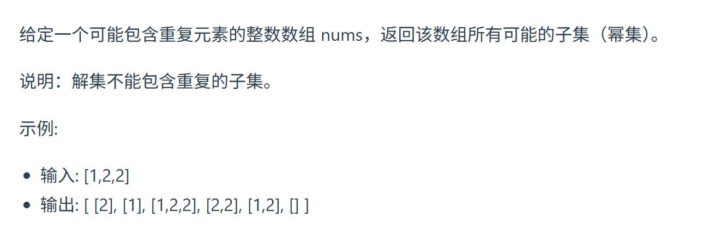
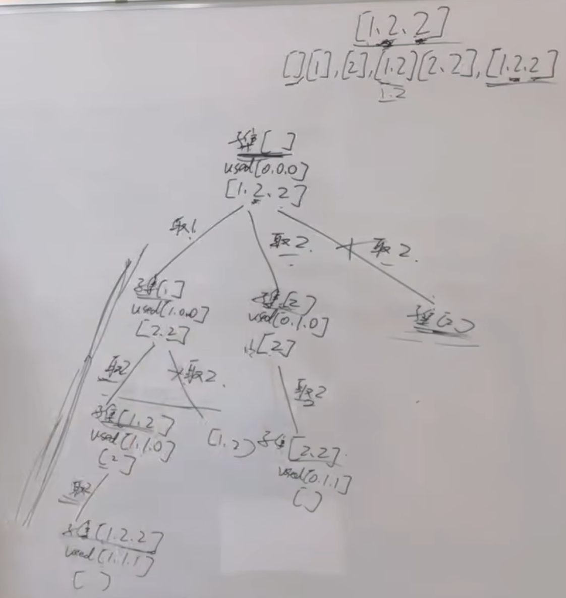
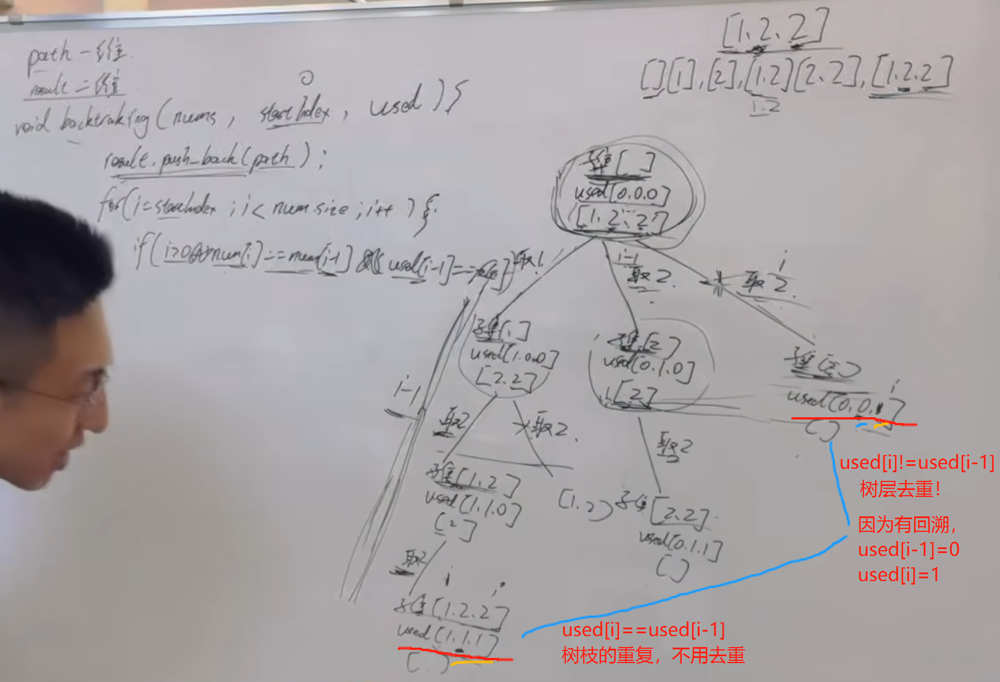

大家之前做了 40.组合总和II 和 78.子集 ，本题就是这两道题目的结合，建议自己独立做一做，本题涉及的知识，之前都讲过，没有新内容。 

题目链接/文章讲解：https://programmercarl.com/0090.%E5%AD%90%E9%9B%86II.html   
视频讲解：https://www.bilibili.com/video/BV1vm4y1F71J

类比：组合总和ii  https://programmercarl.com/0040.%E7%BB%84%E5%90%88%E6%80%BB%E5%92%8CII.html   

## 思路

