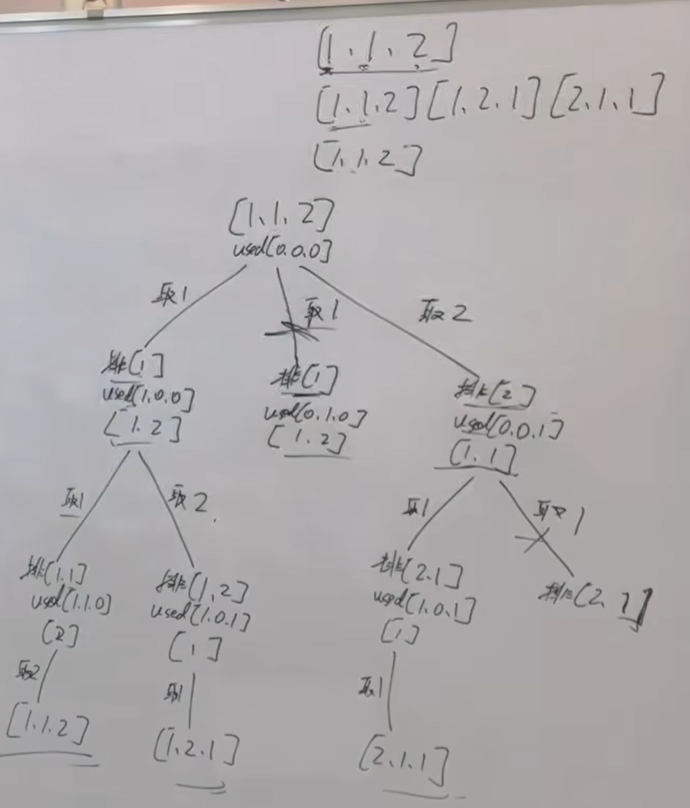

本题 就是我们讲过的 40.组合总和II 去重逻辑 和 46.全排列 的结合，可以先自己做一下，然后重点看一下 文章中 我讲的拓展内容： used[i - 1] == true 也行，used[i - 1] == false 也行 

https://programmercarl.com/0047.%E5%85%A8%E6%8E%92%E5%88%97II.html     
 
视频讲解：https://www.bilibili.com/video/BV1R84y1i7Tm

## 思路
1.<mark>有重复元素</mark>  
2.<mark>需要排序，方便去重</mark>
 