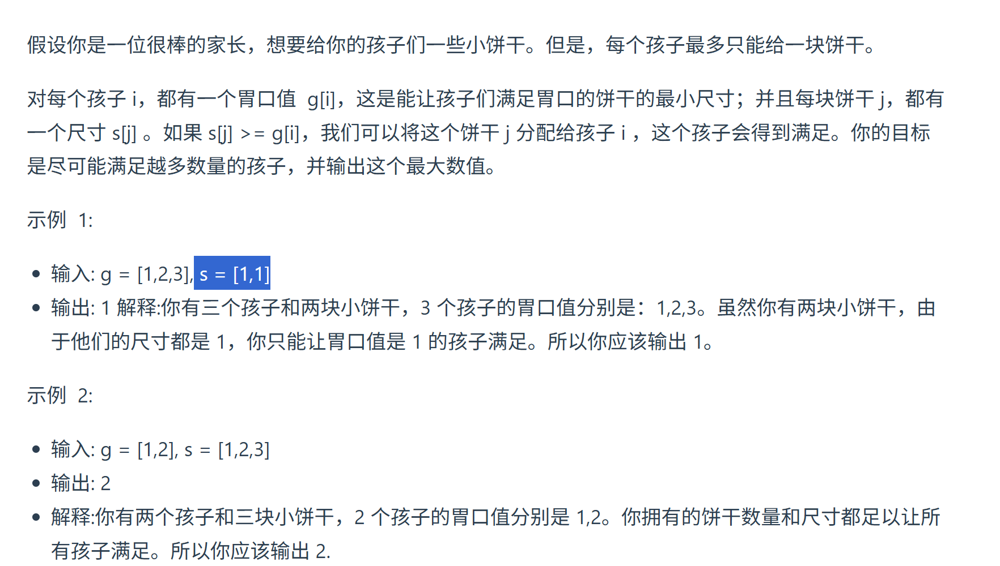
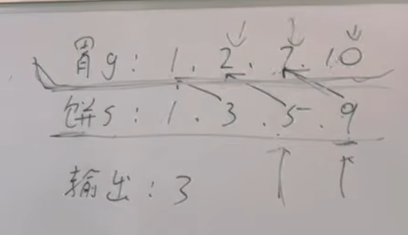

https://programmercarl.com/0455.%E5%88%86%E5%8F%91%E9%A5%BC%E5%B9%B2.html#%E7%AE%97%E6%B3%95%E5%85%AC%E5%BC%80%E8%AF%BE

https://leetcode.cn/problems/assign-cookies/description/

## 思路

用大饼干为大胃口的小孩（局部最优）：  
>这样才充分利用了大规格的饼干

（全局最优）喂饱尽可能多的小孩  
为什么不能先遍历饼干后遍历胃？
>9没有满足10，就不能向后走

