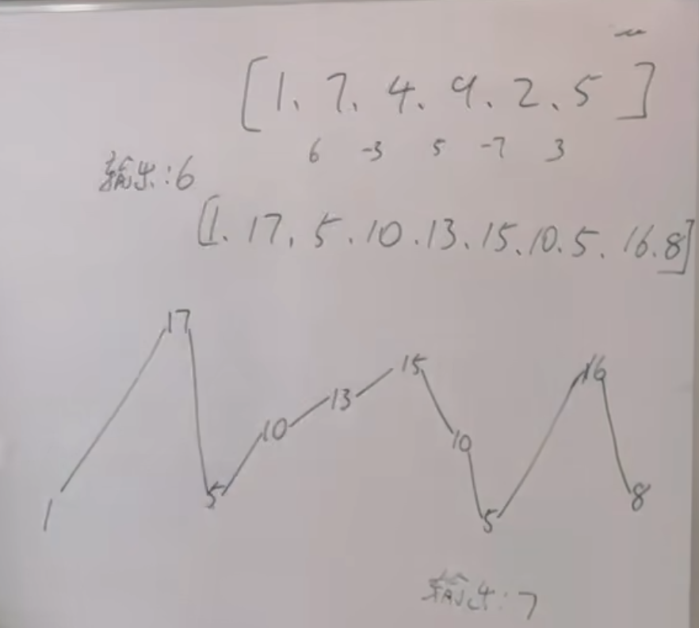
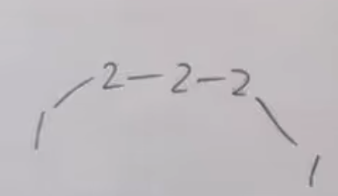
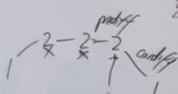
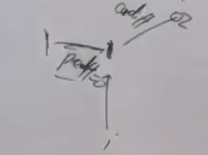
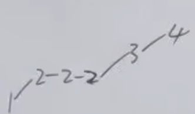

https://programmercarl.com/0376.%E6%91%86%E5%8A%A8%E5%BA%8F%E5%88%97.html#%E7%AE%97%E6%B3%95%E5%85%AC%E5%BC%80%E8%AF%BE  

## 思路

1.不用具体考虑删除的操作，遇到峰、谷，result+=1就可以了

2.出现的情况
- ①上下坡有平坡  
  

`prediff>=0 and curdiff<0`  
`prediff<=0 and curdiff>0`
- ②首尾元素  
   只有两个元素：向前延伸一个相同元素

- ③单调坡中有平坡:prediff只需要记录坡度的变化（初始是0，默认有个平坡）
平坡时，prediff不会改变
