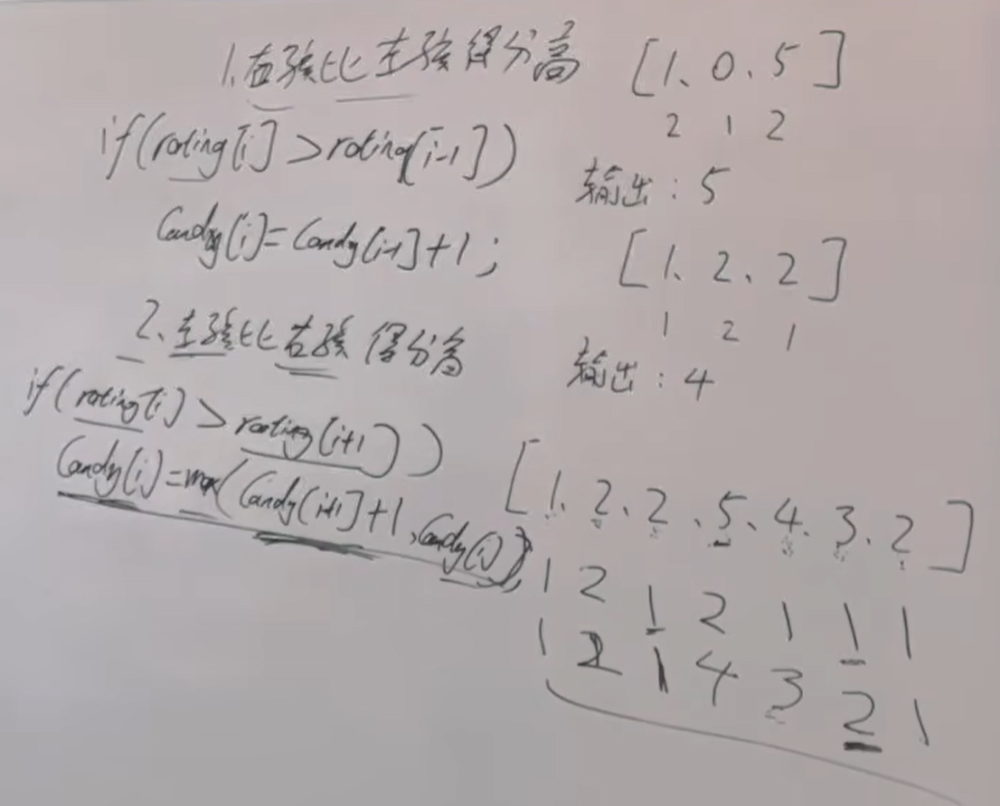
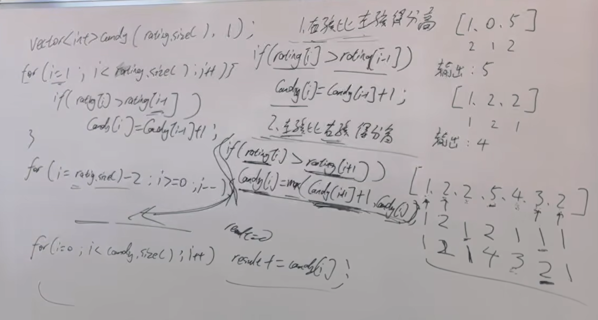

本题涉及到一个思想，就是想处理好一边再处理另一边，不要两边想着一起兼顾，后面还会有题目用到这个思路 
https://programmercarl.com/0135.%E5%88%86%E5%8F%91%E7%B3%96%E6%9E%9C.html  

## 思路
1.两边分别考虑：先确定一边，再确定另一边：   
①情况一：  
右孩比左孩得分高：从前向后遍历  
②情况二：  
左孩比右孩得分高：从后向前遍历

对candy[i]取两种情况下的最值 

