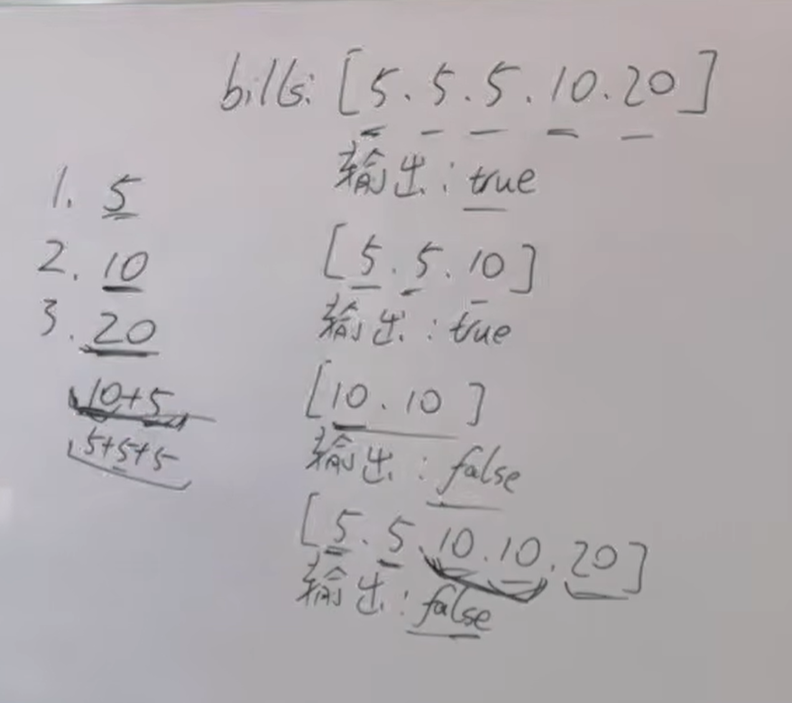

本题看上好像挺难，其实很简单，大家先尝试自己做一做。
https://programmercarl.com/0860.%E6%9F%A0%E6%AA%AC%E6%B0%B4%E6%89%BE%E9%9B%B6.html  

## 思路

三种情况：  
①收到5  
②收到10：看有没有5  
③收到20：
- 10+5找零（优先选择）    <--贪心
- 5+5+5找零

全局最优：可以找零
