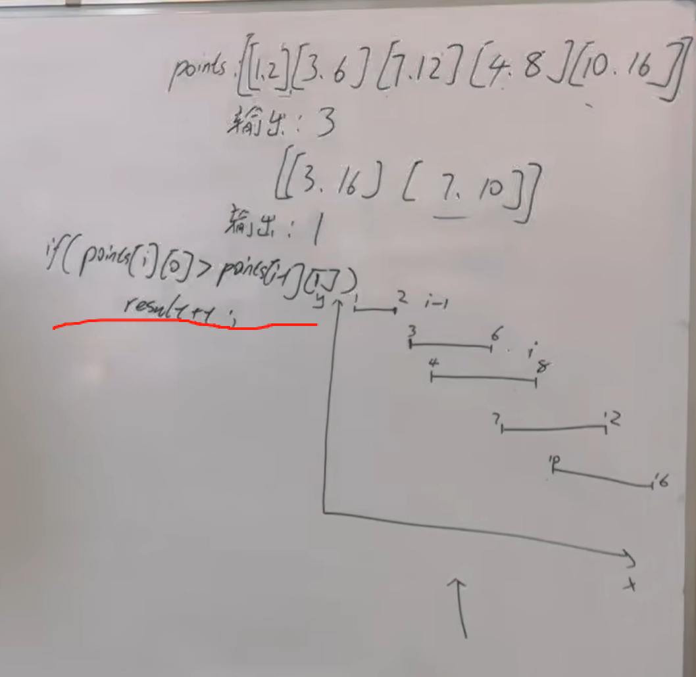
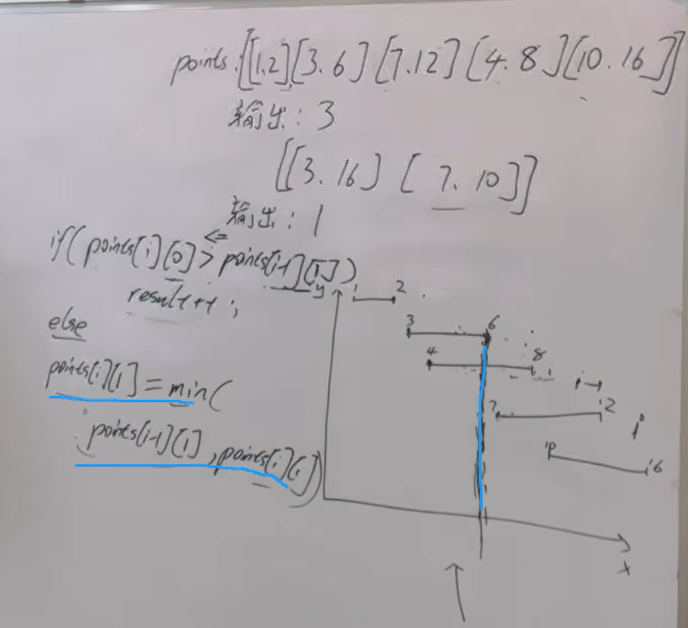
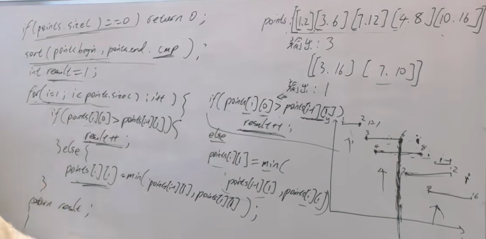

https://programmercarl.com/0452.%E7%94%A8%E6%9C%80%E5%B0%91%E6%95%B0%E9%87%8F%E7%9A%84%E7%AE%AD%E5%BC%95%E7%88%86%E6%B0%94%E7%90%83.html  

## 思路
1.排序  
2.右气球左边界和左气球右边界不重合，result就要+=1  
`if point[i][0]>point[i-1][0]:
result+=1`  

3.第一个气球是否和第三气球重叠  

4.
