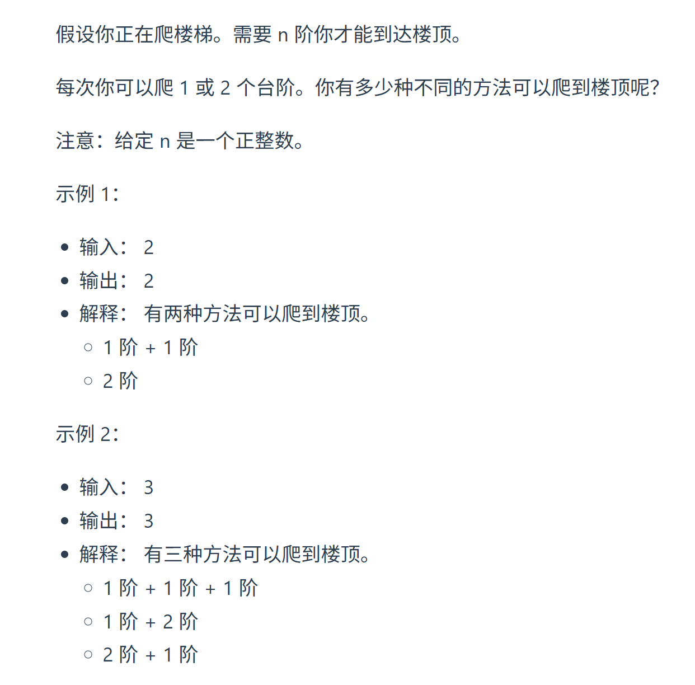
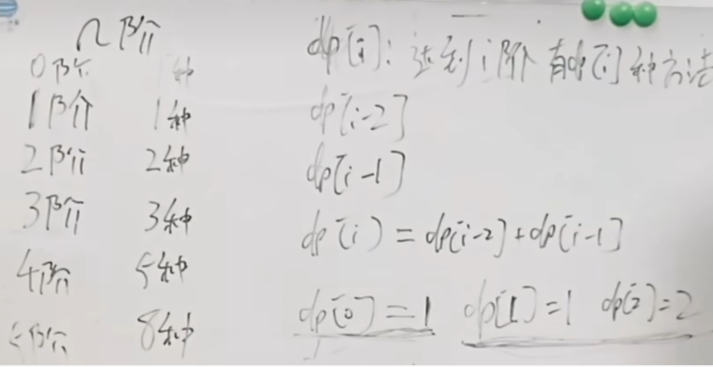

本题大家先自己想一想， 之后会发现，和 斐波那契数 有点关系。

https://programmercarl.com/0070.%E7%88%AC%E6%A5%BC%E6%A2%AF.html  
视频：https://www.bilibili.com/video/BV17h411h7UH  

## 思路--递归5步曲

1.DP数组以及下际的含义  
> 到达i阶有dp[i]种方法

2.递推公式  
3.DP数组如何初始化  
4.遍历顺序  
5.打印DP数组   

