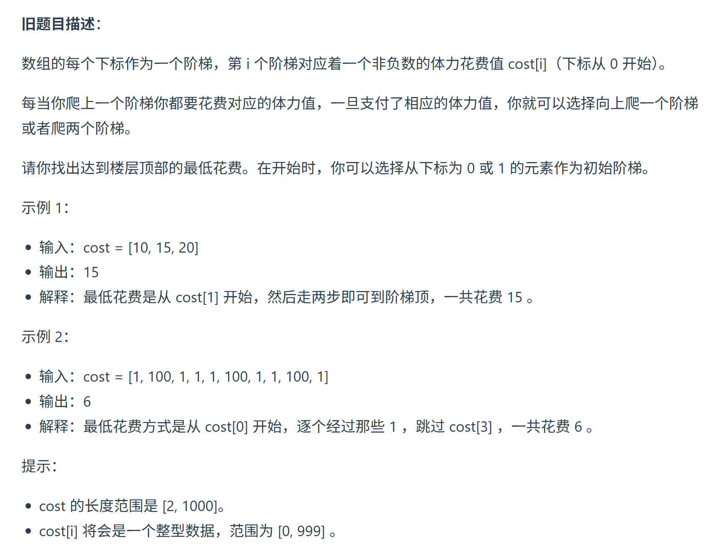
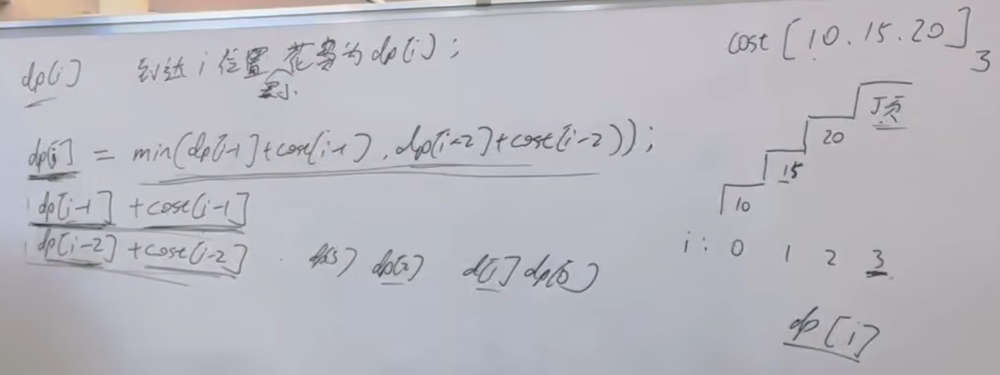

这道题目力扣改了题目描述了，现在的题目描述清晰很多，相当于明确说 第一步是不用花费的。 

更改题目描述之后，相当于是 文章中 「拓展」的解法 

https://programmercarl.com/0746.%E4%BD%BF%E7%94%A8%E6%9C%80%E5%B0%8F%E8%8A%B1%E8%B4%B9%E7%88%AC%E6%A5%BC%E6%A2%AF.html   
视频讲解：https://www.bilibili.com/video/BV16G411c7yZ 



### 1.DP数组以及下标的含义  
> 到达下标 i 的位置，所需要的花费为dp[i]

### 2.递推公式
`dp[i]=min(dp[i-1]+cost[i-1],dp[i-2]+cost[i-2])`
### 3.DP数组如何初始化 
```python
dp[0]=0
dp[1]=0
```
### 4.遍历顺序  
`for i in range(2,len(cost)+1)`
### 5.打印DP数组  

