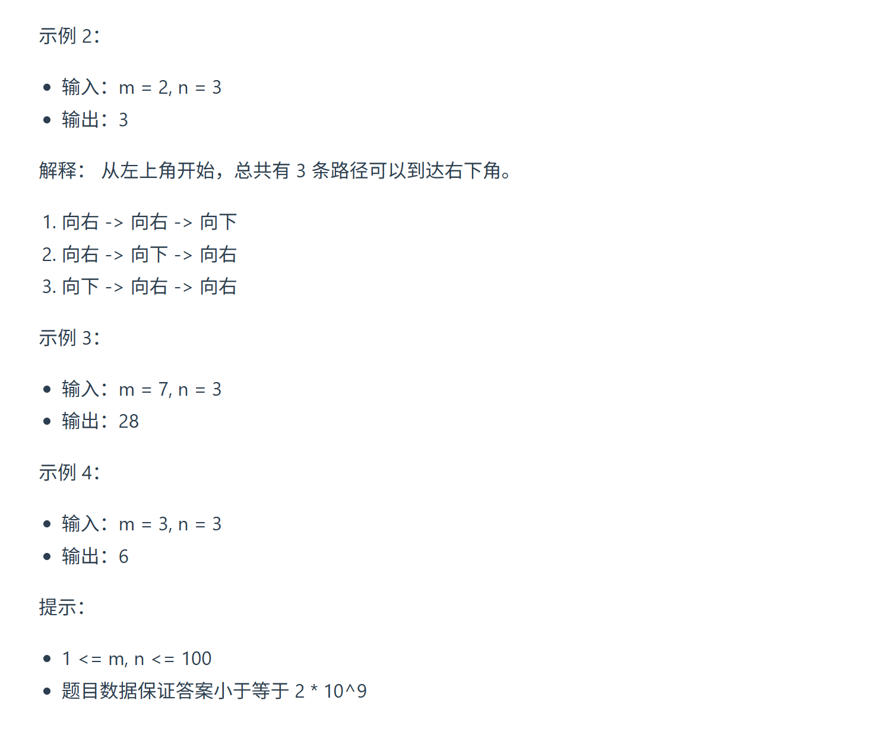
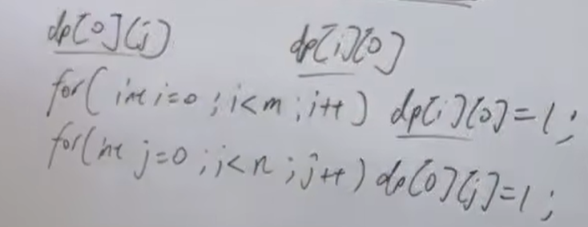

本题大家掌握动态规划的方法就可以。 数论方法 有点非主流，很难想到。 

https://programmercarl.com/0062.%E4%B8%8D%E5%90%8C%E8%B7%AF%E5%BE%84.html  
视频讲解：https://www.bilibili.com/video/BV1ve4y1x7Eu

## 思路
1.`dp[i][j]`含义：走到i行j列有`dp[i][j]`种路径  
2.递推公式：
  
3.初始化：最左和最右需要初始化  
（只能向下或向右走！）  
    
4.遍历顺序

