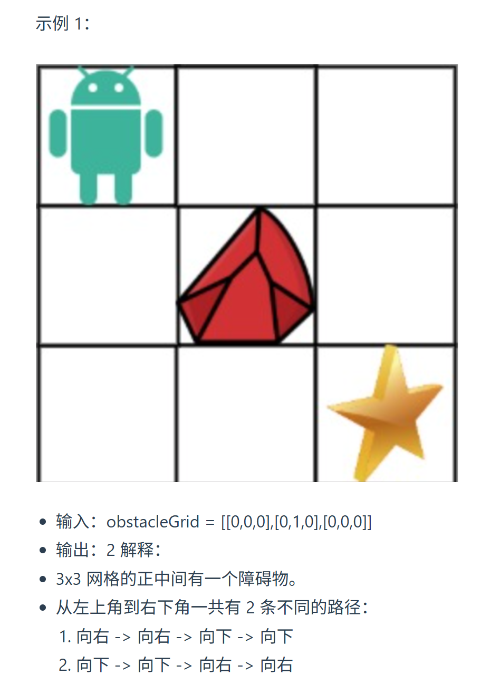
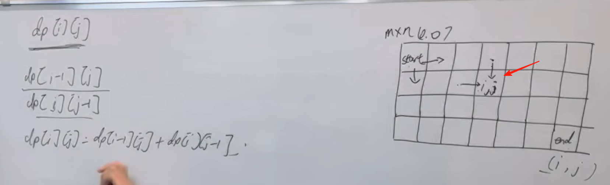
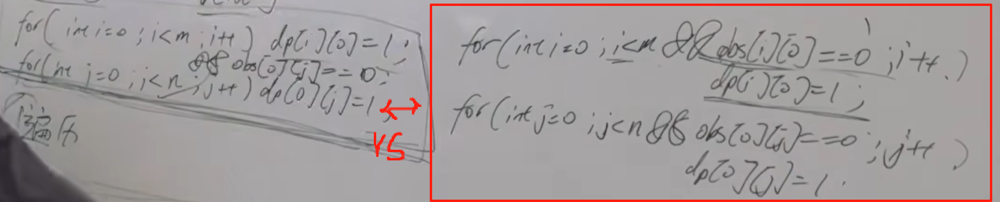

 63. 不同路径 II 

（python 版本二）https://programmercarl.com/0063.%E4%B8%8D%E5%90%8C%E8%B7%AF%E5%BE%84II.html  
视频讲解：https://www.bilibili.com/video/BV1Ld4y1k7c6                  

## 思路
1.`dp[i][j]`含义：走到i行j列有`dp[i][j]`种路径  
2.递推公式：
 

>如果为1：有障碍，continue

3.初始化（**重点**）：最左和最右需要初始化  
（只能向下或向右走！）  
   
4.遍历顺序  

